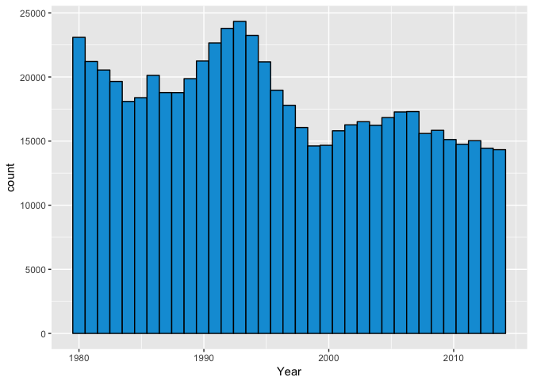
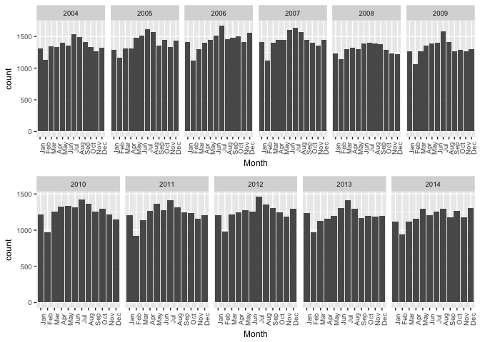
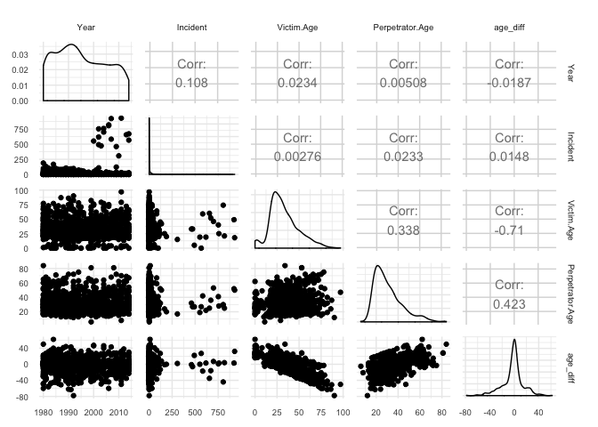
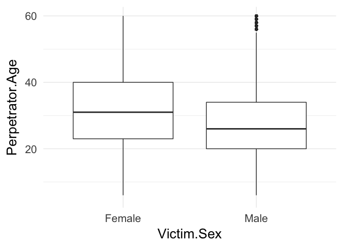
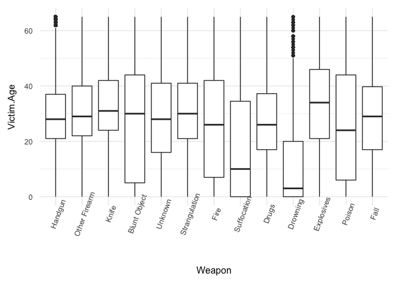
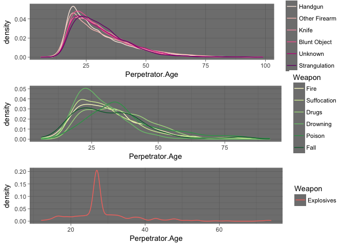
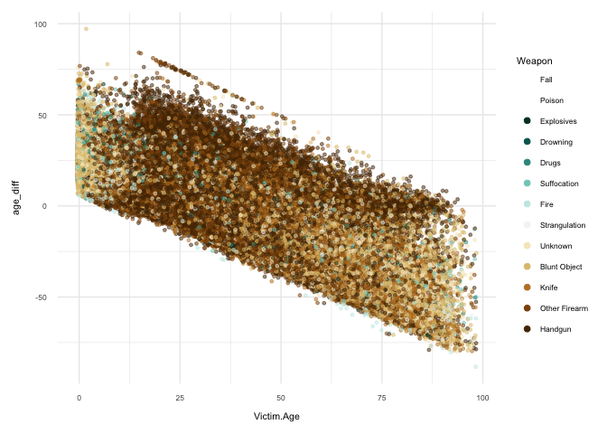
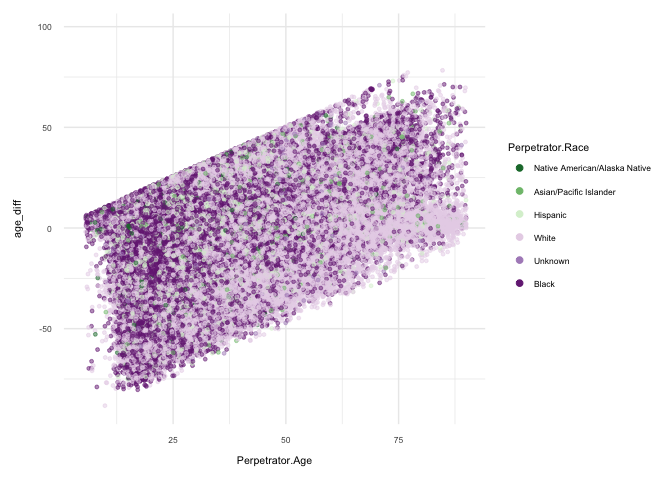

Exploring Homicides
================

===========================================================================================================

This report explores a dataset containing demographic information and other details of victims and perpetrators in about 640,000 homicides in the United States from 1980-2014. Our dataset consists of 29 variables, with nearly 640,000 observations.

Univariate Plots Section
------------------------

``` r
#let's get the dimensions of the dataset
dim(homicides)
```

    ## [1] 638454     24

``` r
str(homicides)
```

    ## 'data.frame':    638454 obs. of  24 variables:
    ##  $ Record.ID            : int  1 2 3 4 5 6 7 8 9 10 ...
    ##  $ Agency.Code          : Factor w/ 12003 levels "AK00101","AK00102",..: 1 1 1 1 1 1 1 1 1 1 ...
    ##  $ Agency.Name          : Factor w/ 9216 levels "Abbeville","Abbeville County",..: 150 150 150 150 150 150 150 150 150 150 ...
    ##  $ Agency.Type          : Factor w/ 7 levels "County Police",..: 2 2 2 2 2 2 2 2 2 2 ...
    ##  $ City                 : Factor w/ 1782 levels "Abbeville","Acadia",..: 36 36 36 36 36 36 36 36 36 36 ...
    ##  $ State                : Factor w/ 51 levels "Alabama","Alaska",..: 2 2 2 2 2 2 2 2 2 2 ...
    ##  $ Year                 : int  1980 1980 1980 1980 1980 1980 1980 1980 1980 1980 ...
    ##  $ Month                : Factor w/ 12 levels "April","August",..: 5 8 8 1 1 9 9 7 7 7 ...
    ##  $ Incident             : int  1 1 2 1 2 1 2 1 2 3 ...
    ##  $ Crime.Type           : Factor w/ 2 levels "Manslaughter by Negligence",..: 2 2 2 2 2 2 2 2 2 2 ...
    ##  $ Crime.Solved         : Factor w/ 2 levels "No","Yes": 2 2 1 2 1 2 2 2 1 2 ...
    ##  $ Victim.Sex           : Factor w/ 3 levels "Female","Male",..: 2 2 1 2 1 2 1 1 2 2 ...
    ##  $ Victim.Age           : int  14 43 30 43 30 30 42 99 32 38 ...
    ##  $ Victim.Race          : Factor w/ 5 levels "Asian/Pacific Islander",..: 3 5 3 5 3 5 3 5 5 5 ...
    ##  $ Victim.Ethnicity     : Factor w/ 3 levels "Hispanic","Not Hispanic",..: 3 3 3 3 3 3 3 3 3 3 ...
    ##  $ Perpetrator.Sex      : Factor w/ 3 levels "Female","Male",..: 2 2 3 2 3 2 2 2 3 2 ...
    ##  $ Perpetrator.Age      : int  15 42 0 42 0 36 27 35 0 40 ...
    ##  $ Perpetrator.Race     : Factor w/ 5 levels "Asian/Pacific Islander",..: 3 5 4 5 4 5 2 5 4 4 ...
    ##  $ Perpetrator.Ethnicity: Factor w/ 3 levels "Hispanic","Not Hispanic",..: 3 3 3 3 3 3 3 3 3 3 ...
    ##  $ Relationship         : Factor w/ 28 levels "Acquaintance",..: 1 1 27 1 27 1 28 28 27 27 ...
    ##  $ Weapon               : Factor w/ 16 levels "Blunt Object",..: 1 14 16 14 16 12 10 10 7 7 ...
    ##  $ Victim.Count         : int  0 0 0 0 0 0 0 0 0 0 ...
    ##  $ Perpetrator.Count    : int  0 0 0 0 1 0 0 0 0 1 ...
    ##  $ Record.Source        : Factor w/ 2 levels "FBI","FOIA": 1 1 1 1 1 1 1 1 1 1 ...

``` r
summary(homicides)
```

    ##    Record.ID       Agency.Code           Agency.Name    
    ##  Min.   :     1   NY03030: 38416   New York    : 38416  
    ##  1st Qu.:159614   CA01942: 23663   Los Angeles : 29007  
    ##  Median :319228   ILCPD00: 21331   Chicago     : 21331  
    ##  Mean   :319228   MI82349: 17206   Detroit     : 17206  
    ##  3rd Qu.:478841   TXHPD00: 12881   Houston     : 13046  
    ##  Max.   :638454   PAPEP00: 12848   Philadelphia: 12861  
    ##                   (Other):512109   (Other)     :506587  
    ##            Agency.Type               City               State       
    ##  County Police   : 22693   Los Angeles : 44511   California: 99783  
    ##  Municipal Police:493026   New York    : 38431   Texas     : 62095  
    ##  Regional Police :   235   Cook        : 22383   New York  : 49268  
    ##  Sheriff         :105322   Wayne       : 19904   Florida   : 37164  
    ##  Special Police  :  2889   Harris      : 16331   Michigan  : 28448  
    ##  State Police    : 14235   Philadelphia: 12851   Illinois  : 25871  
    ##  Tribal Police   :    54   (Other)     :484043   (Other)   :335825  
    ##       Year            Month           Incident     
    ##  Min.   :1980   July     : 58696   Min.   :  0.00  
    ##  1st Qu.:1987   August   : 58072   1st Qu.:  1.00  
    ##  Median :1995   December : 55187   Median :  2.00  
    ##  Mean   :1996   September: 54117   Mean   : 22.97  
    ##  3rd Qu.:2004   June     : 53662   3rd Qu.: 10.00  
    ##  Max.   :2014   October  : 53650   Max.   :999.00  
    ##                 (Other)  :305070                   
    ##                       Crime.Type     Crime.Solved   Victim.Sex    
    ##  Manslaughter by Negligence:  9116   No :190282   Female :143345  
    ##  Murder or Manslaughter    :629338   Yes:448172   Male   :494125  
    ##                                                   Unknown:   984  
    ##                                                                   
    ##                                                                   
    ##                                                                   
    ##                                                                   
    ##    Victim.Age                            Victim.Race    
    ##  Min.   :  0.00   Asian/Pacific Islander       :  9890  
    ##  1st Qu.: 22.00   Black                        :299899  
    ##  Median : 30.00   Native American/Alaska Native:  4567  
    ##  Mean   : 35.03   Unknown                      :  6676  
    ##  3rd Qu.: 42.00   White                        :317422  
    ##  Max.   :998.00                                         
    ##                                                         
    ##      Victim.Ethnicity  Perpetrator.Sex  Perpetrator.Age
    ##  Hispanic    : 72652   Female : 48548   Min.   : 0.00  
    ##  Not Hispanic:197499   Male   :399541   1st Qu.: 0.00  
    ##  Unknown     :368303   Unknown:190365   Median :21.00  
    ##                                         Mean   :20.32  
    ##                                         3rd Qu.:31.00  
    ##                                         Max.   :99.00  
    ##                                         NA's   :1      
    ##                       Perpetrator.Race   Perpetrator.Ethnicity
    ##  Asian/Pacific Islander       :  6046   Hispanic    : 46872   
    ##  Black                        :214516   Not Hispanic:145172   
    ##  Native American/Alaska Native:  3602   Unknown     :446410   
    ##  Unknown                      :196047                         
    ##  White                        :218243                         
    ##                                                               
    ##                                                               
    ##        Relationship             Weapon        Victim.Count    
    ##  Unknown     :273013   Handgun     :317484   Min.   : 0.0000  
    ##  Acquaintance:126018   Knife       : 94962   1st Qu.: 0.0000  
    ##  Stranger    : 96593   Blunt Object: 67337   Median : 0.0000  
    ##  Wife        : 23187   Firearm     : 46980   Mean   : 0.1233  
    ##  Friend      : 21945   Unknown     : 33192   3rd Qu.: 0.0000  
    ##  Girlfriend  : 16465   Shotgun     : 30722   Max.   :10.0000  
    ##  (Other)     : 81233   (Other)     : 47777                    
    ##  Perpetrator.Count Record.Source
    ##  Min.   : 0.0000   FBI :616647  
    ##  1st Qu.: 0.0000   FOIA: 21807  
    ##  Median : 0.0000                
    ##  Mean   : 0.1852                
    ##  3rd Qu.: 0.0000                
    ##  Max.   :10.0000                
    ## 

It looks like for victims, we have nearly 500,000 that are male, 145,000 female, and almost 1,000 unknown. For perpetrators, about 400,000 are male, almost 50,000 female and 190,000 unknown.

``` r
summary(homicides$Victim.Sex)
```

    ##  Female    Male Unknown 
    ##  143345  494125     984

``` r
summary(homicides$Perpetrator.Sex)
```

    ##  Female    Male Unknown 
    ##   48548  399541  190365

``` r
library(ggplot2)
#define individual plots
ggplot(aes(Victim.Age), data = homicides) +
  geom_histogram(binwidth = 1) +
  scale_x_continuous(limits = c(0, 95), breaks = seq(0,95,10))
```


``` r
summary(homicides$Victim.Age)
```

    ##    Min. 1st Qu.  Median    Mean 3rd Qu.    Max. 
    ##    0.00   22.00   30.00   35.03   42.00  998.00

The victim age distribution appears to be pretty much unimodal, peaking at ages 20-25. We do have a little spike in homicides for victims aged 0-1.

``` r
library(gridExtra)
#define individual plots
p1 <- ggplot(aes(Perpetrator.Age), data = homicides) +
  geom_histogram(binwidth = 1) +
  scale_x_continuous(breaks = seq(0,90,10))

p2 <- p1 + scale_x_log10()
```

    ## Scale for 'x' is already present. Adding another scale for 'x', which
    ## will replace the existing scale.

``` r
#arrange plots in grid
grid.arrange(p1, p2, ncol = 1)
```


``` r
#define individual plots
ggplot(aes(Perpetrator.Age), data = homicides) +
  geom_histogram(binwidth = 1) +
  scale_x_continuous(limits = c(10, 90),breaks = seq(10,90,10))
```


``` r
summary(homicides$Perpetrator.Age)
```

    ##    Min. 1st Qu.  Median    Mean 3rd Qu.    Max.    NA's 
    ##    0.00    0.00   21.00   20.32   31.00   99.00       1

After transforming the long tail data for perpetrator age into log scale as well as limiting the axes for potentially erroneous data entries, we see a still somewhat skewed, unimodal distribution. Perpetrator age peaks at 20.

``` r
qplot(x = Perpetrator.Age, y = ..count../sum(..count..),
      data = homicides,
      geom = 'freqpoly', color = Crime.Solved) +
  scale_x_continuous(breaks = c(0,100,10))
```

    ## `stat_bin()` using `bins = 30`. Pick better value with `binwidth`.


It appears that there is a large number of entries in which the Perpetrator Age is 0, and nearly all of them are unsolved homicides. It might be safe to say that for any crime where the perpetrators are not known, they input the value of 0 for perpetrators' age. Might make sense to apply x axis limit to remove 0 values.

``` r
#number of homicides per year over the years
qplot(x = Year, data = homicides, binwidth = .99, color = I('black'), fill = I('#099DD9'))
```



Homicide occurrences peaked between 1990-1995. Occurrences lowered in the late '90s - 2000 and have not reached 1980's & 1990's levels since then.

``` r
#re-organize factors in month column to be sequential months of the year
homicides$Month <- factor(homicides$Month, levels = c('January','February','March','April','May','June','July','August','September','October','November','December'))

#plot monthly homicide volume faceted by year
p1 <- qplot(x = Month, data = subset(homicides, Year == 1980 | Year == 1981 | Year == 1982 | 
                                       Year == 1983 | Year == 1984 | Year == 1985)) +
  theme(text = element_text(size=9), axis.text.x = element_text(angle = 90)) +
  facet_wrap(~ Year, ncol = 6) +
  scale_x_discrete(labels = c("Jan","Feb","Mar","Apr","May","Jun","Jul","Aug","Sep","Oct","Nov","Dec"))

p2 <- qplot(x = Month, data = subset(homicides, Year == 1986 | Year == 1987 | Year == 1988 | 
                                       Year == 1989 | Year == 1990 | Year == 1991)) +
  theme(text = element_text(size=9), axis.text.x = element_text(angle = 90)) +
  facet_wrap(~ Year, ncol = 6) +
  scale_x_discrete(labels = c("Jan","Feb","Mar","Apr","May","Jun","Jul","Aug","Sep","Oct","Nov","Dec"))

grid.arrange(p1, p2, ncol = 1)
```


``` r
#re-organize factors in month column to be sequential months of the year
homicides$Month <- factor(homicides$Month, levels = c('January','February','March','April','May','June','July','August','September','October','November','December'))

#plot monthly homicide volume faceted by year
p1 <- qplot(x = Month, data = subset(homicides, Year == 1992 | Year == 1993 | Year == 1994 | 
                                       Year == 1995 | Year == 1996 | Year == 1997)) +
  theme(text = element_text(size=9), axis.text.x = element_text(angle = 90)) +
  facet_wrap(~ Year, ncol = 6) +
  scale_x_discrete(labels = c("Jan","Feb","Mar","Apr","May","Jun","Jul","Aug","Sep","Oct","Nov","Dec"))

p2 <- qplot(x = Month, data = subset(homicides, Year == 1998 | Year == 1999 | Year == 2000 | 
                                       Year == 2001 | Year == 2002 | Year == 2003)) +
  theme(text = element_text(size=9), axis.text.x = element_text(angle = 90)) +
  facet_wrap(~ Year, ncol = 6) +
  scale_x_discrete(labels = c("Jan","Feb","Mar","Apr","May","Jun","Jul","Aug","Sep","Oct","Nov","Dec"))

grid.arrange(p1, p2, ncol = 1)
```


``` r
#re-organize factors in month column to be sequential months of the year
homicides$Month <- factor(homicides$Month, levels = c('January','February','March','April','May','June','July','August','September','October','November','December'))

#plot monthly homicide volume faceted by year
p1 <- qplot(x = Month, data = subset(homicides, Year == 2004 | Year == 2005 | Year == 2006 | 
                                       Year == 2007 | Year == 2008 | Year == 2009)) +
  theme(text = element_text(size=9), axis.text.x = element_text(angle = 90)) +
  facet_wrap(~ Year, ncol = 6) +
  scale_x_discrete(labels = c("Jan","Feb","Mar","Apr","May","Jun","Jul","Aug","Sep","Oct","Nov","Dec"))

p2 <- qplot(x = Month, data = subset(homicides, Year == 2010 | Year == 2011 | Year == 2012 | 
                                       Year == 2013 | Year == 2014)) +
  theme(text = element_text(size=9), axis.text.x = element_text(angle = 90)) +
  facet_wrap(~ Year, ncol = 6) +
  scale_x_discrete(labels = c("Jan","Feb","Mar","Apr","May","Jun","Jul","Aug","Sep","Oct","Nov","Dec"))

grid.arrange(p1, p2, ncol = 1)
```



Looking at monthly homicide rates faceted over the years, we see that from 2010 onward, not one month of the year has over 1500 homicides. As for where homicide rates peak per year, it varies widely across all months of the year.

``` r
homicides$Month <- factor(homicides$Month, levels = c('January','February','March','April','May','June','July','August','September','October','November','December'))

ggplot(aes(Month), data = homicides) +
  geom_bar() +
  theme(axis.text.x = element_text(angle = 75))
```


In aggregate, it looks like the month of July has the most homicides, with August coming in at a close second.

``` r
summary(homicides$Relationship)
```

    ##         Acquaintance            Boyfriend Boyfriend/Girlfriend 
    ##               126018                 7302                 1383 
    ##              Brother   Common-Law Husband      Common-Law Wife 
    ##                 5514                 1954                 2477 
    ##             Daughter             Employee             Employer 
    ##                 7539                  384                  509 
    ##           Ex-Husband              Ex-Wife               Family 
    ##                  629                 1973                 9535 
    ##               Father               Friend           Girlfriend 
    ##                 4361                21945                16465 
    ##              Husband               In-Law               Mother 
    ##                 8803                 3637                 4248 
    ##             Neighbor               Sister                  Son 
    ##                 6294                 1292                 9904 
    ##         Stepdaughter           Stepfather           Stepmother 
    ##                  754                 1360                  211 
    ##              Stepson             Stranger              Unknown 
    ##                 1170                96593               273013 
    ##                 Wife 
    ##                23187

Let's group Relationship categories further into: Stranger/Unknown perpetrator, Friend/Neighbor/Acquaintance, Boyfriend/Girlfriend, Child/Stepchild, Extended-Family, Parent/Stepparent, Spouse/Ex-spouse, Sibling, Employer/employee.

``` r
#create new column 'Relation' to place factors from 'Relationship' column into buckets
homicides$Relation <- ifelse(homicides$Relationship == 'Acquaintance' | homicides$Relationship == 'Neighbor' | 
                               homicides$Relationship == 'Friend', 'Friend/Neighbor/Acquaintance', 
ifelse(homicides$Relationship == 'Boyfriend' | homicides$Relationship == 'Boyfriend/Girlfriend' | 
         homicides$Relationship == 'Girlfriend', 'Boyfriend/Girlfriend',
ifelse(homicides$Relationship == 'Brother' | homicides$Relationship == 'Sister', 'Sibling',
ifelse(homicides$Relationship == 'Common-Law Husband' | homicides$Relationship == 'Common-Law Wife' | 
         homicides$Relationship == 'Ex-Husband' | homicides$Relationship == 'Ex-Wife', 'Spouse/Ex-Spouse',
ifelse(homicides$Relationship == 'Daughter'| homicides$Relationship == 'Son' | homicides$Relationship == 'Stepdaughter' | homicides$Relationship == 'Stepson', 'Child/Stepchild',
       ifelse(homicides$Relationship == 'Employee' | homicides$Relationship == 'Employer','Employee/Employer',
       ifelse(homicides$Relationship == 'Family' | homicides$Relationship == 'In-Law','Extended.Family',
              ifelse(homicides$Relationship == 'Father' | homicides$Relationship == 'Mother' | 
                       homicides$Relationship == 'Stepfather' | homicides$Relationship == 'Stepmother','Parent/Stepparent', 'Stranger/Unknown'))))))))

#convert Relation column to factor type
homicides$Relation <- factor(homicides$Relation)

#reorder factors in Relation for graph below to be in descending order
homicides$Relation <- with(homicides, reorder(Relation, Relation, function(x) -length(x)))

#graph Relation category of homicides based on percentage of total
ggplot(aes(x = Relation), data = homicides) +
  geom_bar(aes(y = ..count../(sum(..count..))), fill = I('#099DD9')) +
  theme(text = element_text(size=10), axis.text.x = element_text(angle = 70)) +
  scale_y_continuous(labels = scales::percent)
```


Homicides committed by someone unknown or a stranger to the victim are the highest, accounting for slightly over 60% of all homicides in the dataset. Next most common is those committed by a friend, neighbor or acquaintance to the victim - accounting for a little over 20% of all homicides in the dataset. In all, over 80% of homicides are committed by someone the victim either didn't know, or was not super close to.

``` r
homicides <- within(homicides, 
                   Agency.Type <- factor(Agency.Type, 
                                      levels=names(sort(table(Agency.Type), 
                                                        decreasing=TRUE))))

ggplot(aes(Agency.Type), data = homicides) +
  theme(text = element_text(size=10))+
  geom_bar()
```


It looks like by and large, most homicides are under the jurisdiction of municipal police, which is the smallest administrative subdivision.

``` r
homicides$Victim.Race <- ifelse(homicides$Victim.Ethnicity == 'Hispanic', 'Hispanic', 
                                ifelse(homicides$Victim.Race == 'Asian/Pacific Islander', 'Asian/Pacific Islander', 
                                       ifelse(homicides$Victim.Race == 'Black', 'Black', 
                                              ifelse(homicides$Victim.Race == 'White', 'White',
                                                     ifelse(homicides$Victim.Race == 'Native American/Alaska Native', 'Native American/Alaska Native',  'Unknown')))))
```

Consolidated so that hispanic data is included in the Victim.Race variable

``` r
homicides$Perpetrator.Race <- ifelse(homicides$Perpetrator.Ethnicity == 'Hispanic', 'Hispanic', 
                                ifelse(homicides$Perpetrator.Race == 'Asian/Pacific Islander', 'Asian/Pacific Islander', 
                                       ifelse(homicides$Perpetrator.Race == 'Black', 'Black', 
                                              ifelse(homicides$Perpetrator.Race == 'White', 'White',
                                                     ifelse(homicides$Perpetrator.Race == 'Native American/Alaska Native', 'Native American/Alaska Native', 'Unknown')))))
```

Consolidated so that hispanic data is included in the Perpetrator.Race variable

``` r
homicides <- within(homicides, 
                   Victim.Race <- factor(Victim.Race, 
                                      levels=names(sort(table(Victim.Race), 
                                                        decreasing=TRUE))))

ggplot(aes(Victim.Race), data = homicides) +
  theme(text = element_text(size=10))+
  geom_bar()
```


The majority of victims by far are black or white.

``` r
homicides <- within(homicides, 
                   Perpetrator.Race <- factor(Perpetrator.Race, 
                                      levels=names(sort(table(Perpetrator.Race), 
                                                        decreasing=TRUE))))

ggplot(aes(Perpetrator.Race), data = homicides) +
  geom_bar() +
  theme(text = element_text(size=10))
```


The number of black perpetrators is highest, with white perpetrator counts coming in second.

``` r
summary(homicides$Weapon)
```

    ##  Blunt Object      Drowning         Drugs    Explosives          Fall 
    ##         67337          1204          1588           537           190 
    ##          Fire       Firearm           Gun       Handgun         Knife 
    ##          6173         46980          2206        317484         94962 
    ##        Poison         Rifle       Shotgun Strangulation   Suffocation 
    ##           454         23347         30722          8110          3968 
    ##       Unknown 
    ##         33192

Some of the weapon categories are pretty similar, so let's adjust the Weapon variable to group some of them together.

``` r
#Place factors from 'Weapon' column into buckets
homicides$Weapon <- ifelse(homicides$Weapon == 'Firearm' | homicides$Weapon == 'Shotgun' | homicides$Weapon == 'Rifle' | homicides$Weapon == 'Gun', 'Other Firearm', 
                           ifelse(homicides$Weapon == 'Knife', 'Knife', 
                                  ifelse(homicides$Weapon == 'Blunt Object', 'Blunt Object', 
                                         ifelse(homicides$Weapon == 'Unknown', 'Unknown', 
                                                ifelse(homicides$Weapon == 'Strangulation', 'Strangulation',
                                                       ifelse(homicides$Weapon == 'Fire', 'Fire',
                                                              ifelse(homicides$Weapon == 'Suffocation', 'Suffocation',
                                                                     ifelse(homicides$Weapon == 'Drugs', 'Drugs',
                                                                            ifelse(homicides$Weapon == 'Drowning', 'Drowning',
                                                                                   ifelse(homicides$Weapon == 'Explosives', 'Explosives',
                                                                                          ifelse(homicides$Weapon == 'Poison', 'Poison',
                                                                                                 ifelse(homicides$Weapon == 'Fall', 'Fall', 'Handgun'))))))))))))

homicides <- within(homicides, 
                   Weapon <- factor(Weapon, 
                                      levels=names(sort(table(Weapon), 
                                                        decreasing=TRUE))))
ggplot(aes(Weapon), data = homicides) +
  geom_bar() +
  theme(text = element_text(size=10), axis.text.x = element_text(angle = 70))
```


``` r
ggplot(aes(Victim.Age), data = subset(homicides, Victim.Sex == 'Female' | Victim.Sex == 'Male')) +
  geom_histogram(binwidth = 1) +
  scale_x_continuous(limits = c(0, 95), breaks = seq(0,95,10)) +
  facet_wrap( ~ Victim.Sex)
```


Looking at victim age faceted by gender, females peak at 20-30 years old and males peak at around 20 years old. We see for both genders another little peak in the 0-5 age range.

``` r
ggplot(aes(Perpetrator.Age), data = subset(homicides, 
                                           Perpetrator.Sex == 'Female' | Perpetrator.Sex == 'Male')) +
  geom_histogram(binwidth = 1) +
  scale_x_continuous(limits = c(5, 90), breaks = seq(5,90,10)) +
  facet_wrap( ~ Perpetrator.Sex)
```


Looking at perpetrator age faceted by male and female, they peak at 20-25 for females, and at around 20 for males.

``` r
qplot(x = Victim.Age, y = ..count../sum(..count..),
      data = subset(homicides, Victim.Sex == 'Female' | Victim.Sex == 'Male'),
      ylab = 'Proportion of Victims that Age',
      geom = 'freqpoly', color = Victim.Sex) +
  scale_x_continuous(lim = c(0, 90), breaks = seq(0,90,10))
```

    ## `stat_bin()` using `bins = 30`. Pick better value with `binwidth`.


Looking at victim ages by sex as a proportion of all homicides in the dataset, we see that male victims aged 20-25 take the highest rate, at over 8% of all homicides.

``` r
qplot(x = Perpetrator.Age, y = ..count../sum(..count..),
      data = subset(homicides, Perpetrator.Sex == 'Female' | Perpetrator.Sex == 'Male'),
      ylab = 'Proportion of Perps that Age',
      geom = 'freqpoly', color = Perpetrator.Sex) +
  scale_x_continuous(lim = c(5, 90), breaks = seq(5,90,10))
```

    ## `stat_bin()` using `bins = 30`. Pick better value with `binwidth`.


Looking at perpetrator ages by gender as a percentage of all homicides, we see two peaks. Males aged about 17/18 taking about 12% of all homicides, and males aged about 23/24 taking about 11% of all homicides.

``` r
qplot(x = Victim.Age, y = ..count../sum(..count..),
      data = subset(homicides, Perpetrator.Sex == 'Female' | Perpetrator.Sex == 'Male'),
      ylab = 'Proportion perps killing someone that age',
      geom = 'freqpoly', color = Perpetrator.Sex) +
  scale_x_continuous(lim = c(0, 90), breaks = seq(0,90,10))
```

    ## `stat_bin()` using `bins = 30`. Pick better value with `binwidth`.


Male perpetrators killing victims aged 20-25 peak at between 9-10% of all cases.

``` r
p1 <- qplot(x = Year,
            data = homicides,
            geom = 'freqpoly', color = Crime.Solved)
p2 <- qplot(x = Year, y = ..count../sum(..count..),
            data = homicides,
            geom = 'freqpoly', color = Crime.Solved)

grid.arrange(p1, p2, ncol = 1)
```

    ## `stat_bin()` using `bins = 30`. Pick better value with `binwidth`.
    ## `stat_bin()` using `bins = 30`. Pick better value with `binwidth`.


It looks like the rate of solving crimes is at all times higher than the rate of non-solved homicides.

``` r
qplot(x = Victim.Age,
      data = homicides,
      geom = 'freqpoly', color = Crime.Solved) +
  scale_x_continuous(lim = c(0, 90), breaks = seq(0,90,10))
```

    ## `stat_bin()` using `bins = 30`. Pick better value with `binwidth`.


The rate of solving crimes is at all victim ages higher than the rate of non-solved homicides. The difference between solved and non-solved is closest at victims aged about 12-13.

``` r
p1 <- qplot(x = Victim.Age,
            data = subset(homicides, Victim.Sex == 'Female'),
            xlab = 'Age - Female Victim',
            geom = 'freqpoly', color = Crime.Solved) +
  scale_x_continuous(lim = c(0, 90), breaks = seq(0,90,10))

p2 <- qplot(x = Victim.Age,
            data = subset(homicides, Victim.Sex == 'Male'),
            xlab = 'Age - Male Victim',
            geom = 'freqpoly', color = Crime.Solved) +
  scale_x_continuous(lim = c(0, 90), breaks = seq(0,90,10))

grid.arrange(p1, p2, ncol = 1)
```

    ## `stat_bin()` using `bins = 30`. Pick better value with `binwidth`.
    ## `stat_bin()` using `bins = 30`. Pick better value with `binwidth`.


When looking at solved crime rated between male and female victims, we see overall a smaller difference between solved and non-solved rates in male victims.

``` r
p1 <- qplot(x = Victim.Age,
            data = subset(homicides, Victim.Sex == 'Female' & Perpetrator.Sex != 'Unknown'),
            xlab = 'Age - Female Victim',
            binwidth = 10, geom = 'freqpoly', color = Perpetrator.Sex) +
  scale_x_continuous(lim = c(0, 90), breaks = seq(0,90,10))

p2 <- qplot(x = Victim.Age,
            data = subset(homicides, Victim.Sex == 'Male' & Perpetrator.Sex != 'Unknown'),
            xlab = 'Age - Male Victim',
            binwidth = 10, geom = 'freqpoly', color = Perpetrator.Sex) +
  scale_x_continuous(lim = c(0, 90), breaks = seq(0,90,10))

grid.arrange(p1, p2, ncol = 1)
```


Above, we see that both female and male victims are far more often killed by a male perpetrator.

``` r
by(homicides$Victim.Age, homicides$Victim.Sex, summary)
```

    ## homicides$Victim.Sex: Female
    ##    Min. 1st Qu.  Median    Mean 3rd Qu.    Max. 
    ##    0.00   22.00   32.00   36.25   46.00  998.00 
    ## -------------------------------------------------------- 
    ## homicides$Victim.Sex: Male
    ##    Min. 1st Qu.  Median    Mean 3rd Qu.    Max. 
    ##    0.00   22.00   29.00   33.28   40.00  998.00 
    ## -------------------------------------------------------- 
    ## homicides$Victim.Sex: Unknown
    ##    Min. 1st Qu.  Median    Mean 3rd Qu.    Max. 
    ##     0.0    87.5   998.0   737.8   998.0   998.0

Female victims have a median age of 32, and male victims have a median age of 29. There is also clearly some erroneous data. Let's get rid of Victim ages above 99 and perpetrator ages below 5.

``` r
#control for erroneous victim and perpetrator ages in dataset
homicides <- subset(homicides, Victim.Age < 99 & Perpetrator.Age > 5)
```

``` r
by(homicides$Victim.Age, homicides$Victim.Sex, summary)
```

    ## homicides$Victim.Sex: Female
    ##    Min. 1st Qu.  Median    Mean 3rd Qu.    Max. 
    ##    0.00   22.00   32.00   34.59   45.00   98.00 
    ## -------------------------------------------------------- 
    ## homicides$Victim.Sex: Male
    ##    Min. 1st Qu.  Median    Mean 3rd Qu.    Max. 
    ##    0.00   22.00   29.00   31.99   40.00   98.00 
    ## -------------------------------------------------------- 
    ## homicides$Victim.Sex: Unknown
    ##    Min. 1st Qu.  Median    Mean 3rd Qu.    Max. 
    ##    0.00    1.00   24.00   25.24   41.00   89.00

``` r
by(homicides$Perpetrator.Age, homicides$Perpetrator.Sex, summary)
```

    ## homicides$Perpetrator.Sex: Female
    ##    Min. 1st Qu.  Median    Mean 3rd Qu.    Max. 
    ##    6.00   23.00   30.00   32.66   40.00   99.00 
    ## -------------------------------------------------------- 
    ## homicides$Perpetrator.Sex: Male
    ##    Min. 1st Qu.  Median    Mean 3rd Qu.    Max. 
    ##     6.0    21.0    27.0    30.5    37.0    99.0 
    ## -------------------------------------------------------- 
    ## homicides$Perpetrator.Sex: Unknown
    ##    Min. 1st Qu.  Median    Mean 3rd Qu.    Max. 
    ##   11.00   22.00   27.00   37.34   49.00   99.00

``` r
homicides$State.Pop <- ifelse(homicides$State == 'Alabama', as.integer(4863000), 
                              ifelse(homicides$State == 'Alaska', as.integer(741894),
                                     ifelse(homicides$State == 'Arkansas', as.integer(2988000),
                                            ifelse(homicides$State == 'Arizona', as.integer(6931000),
                                                   ifelse(homicides$State == 'Georgia', as.integer(10310000),
                                                          ifelse(homicides$State == 'Wyoming', as.integer(585501),
                                                                 ifelse(homicides$State == 'Wisconsin', as.integer(5779000),
                                                                        ifelse(homicides$State == 'Washington', as.integer(7288000),
                                                                               ifelse(homicides$State == 'West Virginia', as.integer(1831000),
                                                                                      ifelse(homicides$State == 'Virginia', as.integer(8412000),
                                                                                             ifelse(homicides$State == 'Utah', as.integer(3051000),
                                                                                                    ifelse(homicides$State == 'Tennessee', as.integer(6651000), 
                                                                                                           ifelse(homicides$State == 'Texas', as.integer(27860000), 
                                                                                                                  ifelse(homicides$State == 'Vermont', as.integer(624594),
                                                                                                                                                ifelse(homicides$State == 'South Carolina', as.integer(4961000),
                                                                                                                                                       ifelse(homicides$State == 'South Dakota', as.integer(865454),
                                                                                                                                                              ifelse(homicides$State == 'Rhode Island', as.integer(1056000),
                                                                                                                                                                     ifelse(homicides$State == 'Pennsylvania', as.integer(12780000),
                                                                                                                                                                            ifelse(homicides$State == 'Oklahoma', as.integer(3924000),
                                                                                                                                                                                   ifelse(homicides$State == 'Ohio', as.integer(11610000),
                                                                                                                                                                                          ifelse(homicides$State == 'Oregon', as.integer(4093000),
                                                                                                                                                                                                 ifelse(homicides$State == 'Massachusetts', as.integer(6812000),
                                                                                                                                                                                                        ifelse(homicides$State == 'North Dakota', as.integer(757952),
                                                                                                                                                                                                               ifelse(homicides$State == 'North Carolina', as.integer(10150000),
                                                                                                                                                                                                                      ifelse(homicides$State == 'New Mexico', as.integer(2081000),
                                                                                                                                                                                                                             ifelse(homicides$State == 'Nebraska', as.integer(1907000),
                                                                                                                                                                                                                                    ifelse(homicides$State == 'New York', as.integer(19750000),
                                                                                                                                                                                                                                           ifelse(homicides$State == 'New Hampshire', as.integer(1335000),
                                                                                                                                                                                                                                                  ifelse(homicides$State == 'Nevada', as.integer(2940000),
                                                                                                                                                                                                                                                         ifelse(homicides$State == 'Missouri', as.integer(6093000),
                                                                                                                                                                                                                                                                ifelse(homicides$State == 'Minnesota', as.integer(5520000),
                                                                                                                                                                                                                                                                       ifelse(homicides$State == 'Maine', as.integer(1331000),
                                                                                                                                                                                                                                                                              ifelse(homicides$State == 'Montana', as.integer(1043000),
                                                                                                                                                                                                                                                                                     ifelse(homicides$State == 'Mississippi', as.integer(2989000),
                                                                                                                                                                                                                                                                                            ifelse(homicides$State == 'Michigan', as.integer(9928000), 
                                                                                                                                                                                                                                                                                                   ifelse(homicides$State == 'Maryland', as.integer(6016000), 
                                                                                                                                                                                                                                                                                                          ifelse(homicides$State == 'Louisiana', as.integer(4682000), 
                                                                                                                                                                                                                                                                                                                 ifelse(homicides$State == 'Kentucky', as.integer(4437000), 
                                                                                                                                                                                                                                                                                                                        ifelse(homicides$State == 'Kansas', as.integer(2907000),
                                                                                                                                                                                                                                                                                                                               ifelse(homicides$State == 'Indiana', as.integer(6633000),
                                                                                                                                                                                                                                                                                                                                      ifelse(homicides$State == 'Illinois', as.integer(12800000),
                                                                                                                                                                                                                                                                                                                                             ifelse(homicides$State == 'Idaho', as.integer(1683000),
                                                                                                                                                                                                                                                                                                                                                    ifelse(homicides$State == 'Iowa', as.integer(3135000),
                                                                                                                                                                                                                                                                                                                                                           ifelse(homicides$State == 'Hawaii', as.integer(1429000),
                                                                                                                                                                                                                                                                                                                                                                  ifelse(homicides$State == 'Florida', as.integer(20610000),
                                                                                                                                                                                                                                                                                                                                                                         ifelse(homicides$State == 'Delaware', as.integer(952065),
                                                                                                                                                                                                                                                                                                                                                                                ifelse(homicides$State == 'Connecticut', as.integer(3576000),
                                                                                                                                                                                                                                                                                                                                                                                       ifelse(homicides$State == 'California', as.integer(39250000),
                                                                                                                                                                                                                                                                                                                                                                                              ifelse(homicides$State == 'Colorado', as.integer(5541000),(8944000))))))))))))))))))))))))))))))))))))))))))))))))))
```

``` r
#another quantitative variable
summary(homicides$State.Pop)
```

    ##     Min.  1st Qu.   Median     Mean  3rd Qu.     Max. 
    ##   585501  6016000 10310000 15619269 20610000 39250000

I added a variable of state populations, State.Pop

``` r
#another quantitative variable
homicides$age_diff <- homicides$Perpetrator.Age - homicides$Victim.Age
summary(homicides$age_diff)
```

    ##    Min. 1st Qu.  Median    Mean 3rd Qu.    Max. 
    ## -88.000  -9.000   0.000  -1.899   6.000  97.000

I added another quantitative variable of age difference between victim and perpetrator

Univariate Analysis
-------------------

### What is the structure of your dataset?

There are close to 638,450 homicides in the dataset with 24 details for each case (agency, location, time, solved or not, victim and perpetrator demographics, relationship between victim and perpetrator, weapon used, and some other details we won't really need for our analysis).

Some observations: - Most victims are male - Most perpetrators are male - The median victim age is 30 - The median perpetrator age is 21 - Over 60% of homicides are committed by an unknown perpetrator, or one that is a stranger to the victim

### What are the main features of interest in your dataset?

The main features of this dataset are Victim.Age and Perpetrator.Age. I'd like to understand trends that may exist in who is killing who. I believe that a combination of certain contextual factors to the crime have something to do with the patterns we see in homicides.

### What other features in the dataset do you think will help support your investigation into your features of interest?

Victim.Sex, Perpetrator.Sex, Victim.Race, Perpetrator.Race, Relationship, Month, and City/State likely contribute to any trends we see in homicide levels. Other things like weapon used, I also believe have marginal insights to offer. Relationship and gender I believe have the biggest influences on homicide rates at certain ages for both victim and perpetrator.

### Did you create any new variables in the dataset?

I created a variable for state populations so that as we investigate further, we can explore based upon homicide rates by state and control for homicides as a percentage of total population. Some argue whether homicides take place more in rural or urban areas, so it would be interesting to look at things from this angle.

I also noticed that 'Hispanic' as a race is not included in the race variable for either victim or perpetrator. Instead it had it's own variable that wouldn't make things very seamless in the analysis. I consolidated so that 'hispanic' is included as a factor in the race variable for both victims and perpetrators. In considering whether one is hispanic, regardless of whether they are white, black, etc. I believe that the culture aspects of being hispanic play a larger role in their involvement in homicide than the color of their skin.

### Of the features you investigated, were there any unusual distributions? Did you perform any operations on the data to tidy, adjust, or change the form of the data? If so, why did you do this?

We saw that in perpetrator ages, often an unsolved homicide (in which, by definition the perpetrator is unknown) will record it at age 0. For this reason, we will control in our analyses for perpetrators aged over 5.

We also saw that in victim ages, the impossible number of 998 exists. This is clearly an error or an automatic entry when for whatever reason, the victim is unknown. Overall, we will control for victims aged under 90 or 95.

Bivariate Plots
---------------

``` r
#install.packages('GGally')
library(GGally)

#install.packages('reshape2')
library(reshape2)

#install.packages("dplyr")
library(dplyr)
```

    ## 
    ## Attaching package: 'dplyr'

    ## The following object is masked from 'package:GGally':
    ## 
    ##     nasa

    ## The following object is masked from 'package:gridExtra':
    ## 
    ##     combine

    ## The following objects are masked from 'package:stats':
    ## 
    ##     filter, lag

    ## The following objects are masked from 'package:base':
    ## 
    ##     intersect, setdiff, setequal, union

``` r
#install.packages('RColorBrewer')
library(RColorBrewer)
```

``` r
theme_set(theme_minimal(20))

#set seed to get reproducible results
set.seed(1836)
homicides_subset <- homicides[c("Year","Incident","Victim.Age","Perpetrator.Age","age_diff")]
names(homicides_subset)
```

    ## [1] "Year"            "Incident"        "Victim.Age"      "Perpetrator.Age"
    ## [5] "age_diff"

``` r
#create plot matrix
ggpairs(homicides_subset[sample.int(nrow(homicides_subset), 1000), ]) +
  theme(text = element_text(size = 9))
```



From this plot matrix, age differences seem to have strong correlations with victim and perpetrator ages. Let's take a closer look at the relationships between the ages of those involved in homicides.

``` r
qplot(x = Victim.Sex, y = Victim.Age,
      data = subset(homicides, Victim.Sex == 'Female' | Victim.Sex == 'Male' & Victim.Age < 100),
      geom = 'boxplot', ylim = c(0,60))
```


Both male and female victims for the most part range in age from 20 to 40, with males typically being just slightly younger than females.


Both male and female perpetrators for the most part range in age from 20 to 40, with females typically being slightly older than males.


When looking at victim age based on perpetrator sex, we don't see much of a difference between the two. We just see that for female perpetrators, victim age has a slightly larger inter quartile range, from 20 to just over 40. And for male perpetrators, victims inter quartile age range is from early 20s to late 30s.

``` r
qplot(x = Victim.Sex, y = Perpetrator.Age,
      data = subset(homicides, Victim.Sex == 'Female' | 
                      Victim.Sex == 'Male' & Perpetrator.Age > 5 & Perpetrator.Age < 100),
      geom = 'boxplot', ylim = c(5,60))
```



Perpetrators of female victims are for the most part slightly older than perpetrators of male victims.

``` r
#deal with overplotting
ggplot(aes(x = Victim.Age, y = Perpetrator.Age), data = homicides) + 
  geom_jitter(alpha = 1/20) + 
  scale_x_continuous(limits = c(0, 95), breaks = seq(5,95,5)) +
  scale_y_continuous(limits = c(10, 95), breaks = seq(10,95,5)) +
  coord_trans(y = 'sqrt')
```


There doesn't appear to be a particular relationship between victim age and perpetrator age. We see a clump of data points in the victim age 0-5 range, where perpetrator age ranges from 15-40 (mostly). From victim age 10 forward, there's a very vague positive relationship with perpetrator age.

``` r
#overlaying summaries with raw data
ggplot(aes(x = Victim.Age, y = Perpetrator.Age), data = subset(homicides, Perpetrator.Age > 5)) + 
  geom_point(alpha = 1/20, position = position_jitter(h = 0), color = 'orange') + 
  coord_cartesian(xlim = c(0, 80), ylim = c(10,80)) +
  geom_line(stat = 'summary', fun.y = mean) +
  geom_line(stat = 'summary', fun.y = quantile, fun.args = list(probs = .1), linetype = 2, color = 'blue') +
  geom_line(stat = 'summary', fun.y = quantile, fun.args = list(probs = .5), color = 'blue') +
  geom_line(stat = 'summary', fun.y = quantile, fun.args = list(probs = .9), linetype = 2, color = 'blue')
```


The dashed lines are the 10th and 90th percentiles. The black solid line is the mean, and the blue solid line is the median.

``` r
cor.test(homicides$Victim.Age, homicides$Perpetrator.Age)
```

    ## 
    ##  Pearson's product-moment correlation
    ## 
    ## data:  homicides$Victim.Age and homicides$Perpetrator.Age
    ## t = 266.87, df = 418010, p-value < 2.2e-16
    ## alternative hypothesis: true correlation is not equal to 0
    ## 95 percent confidence interval:
    ##  0.3789525 0.3841328
    ## sample estimates:
    ##       cor 
    ## 0.3815457

When controlling for errors in the data, the correlation between victim age and perpetrator age increases from what we saw earlier, to .38.

``` r
ggplot(aes(x = Victim.Age, y = Perpetrator.Age), data = homicides) + 
  geom_point(alpha = 1/20, position = position_jitter(h = 0)) + 
  coord_cartesian(xlim = c(0, 80), ylim = c(5,80)) +
  geom_smooth(method = 'lm', color = 'orange')
```


Drawing a linear model line through the victim and perpetrator ages scatter plot shows a weak alignment with the data.

``` r
#conditional means
hom.vicperpage <- homicides %>%
  group_by(Victim.Age) %>%
  summarise(perpage_mean = mean(Perpetrator.Age),
            perpage_median = median(Perpetrator.Age),
            n = n()) %>%
  arrange(Victim.Age)

ggplot(aes(x = Victim.Age, y = perpage_mean), data = hom.vicperpage) +
  geom_line() +
  scale_x_continuous(limits = c(0,95), breaks = seq(0,95,5)) + 
  geom_smooth()
```

    ## `geom_smooth()` using method = 'loess'


When we look at victim age by mean perpetrator age, we do see some what of a positive linear relationship when smoothed out over the inconsistencies in young victim ages.

``` r
ggplot(aes(x = Victim.Age, y = age_diff), data = homicides) + 
  geom_jitter(alpha = 1/20)
```


As victim age increases, the age difference between perpetrator and victim decreases, and then continuously increases again in the opposite direction.

``` r
ggplot(aes(x = Perpetrator.Age, y = age_diff), data = homicides) + 
  geom_jitter(alpha = 1/20)
```


As perpetrator age increases, age difference between perpetrator and victim decreases, and then increases again in opposite direction to form a continuous positive linear relationship.

``` r
qplot(x = Victim.Race, y = Year,
      data = homicides, geom = 'boxplot', fill = 'Orange') +
  theme(text = element_text(size=10))
```


``` r
#get summary stats on Year according to race
by(homicides$Year, homicides$Victim.Race, summary)
```

    ## homicides$Victim.Race: Black
    ##    Min. 1st Qu.  Median    Mean 3rd Qu.    Max. 
    ##    1980    1987    1994    1995    2004    2014 
    ## -------------------------------------------------------- 
    ## homicides$Victim.Race: White
    ##    Min. 1st Qu.  Median    Mean 3rd Qu.    Max. 
    ##    1980    1987    1995    1996    2004    2014 
    ## -------------------------------------------------------- 
    ## homicides$Victim.Race: Hispanic
    ##    Min. 1st Qu.  Median    Mean 3rd Qu.    Max. 
    ##    1980    1986    1994    1995    2004    2014 
    ## -------------------------------------------------------- 
    ## homicides$Victim.Race: Asian/Pacific Islander
    ##    Min. 1st Qu.  Median    Mean 3rd Qu.    Max. 
    ##    1980    1991    1997    1998    2006    2014 
    ## -------------------------------------------------------- 
    ## homicides$Victim.Race: Unknown
    ##    Min. 1st Qu.  Median    Mean 3rd Qu.    Max. 
    ##    1980    1989    1999    1998    2007    2014 
    ## -------------------------------------------------------- 
    ## homicides$Victim.Race: Native American/Alaska Native
    ##    Min. 1st Qu.  Median    Mean 3rd Qu.    Max. 
    ##    1980    1987    1995    1996    2005    2014

Across all known races, the median year in which homicides occurred is 1994-1997, with a majority of homicides occurring before 2006.

``` r
qplot(x = Weapon, y = Year,
      data = homicides, geom = 'boxplot') +
  theme(text = element_text(size = 12), axis.text.x = element_text(angle = 70))
```


``` r
#get summary stats on Year according to weapon
by(homicides$Year, homicides$Weapon, summary)
```

    ## homicides$Weapon: Handgun
    ##    Min. 1st Qu.  Median    Mean 3rd Qu.    Max. 
    ##    1980    1987    1994    1995    2003    2014 
    ## -------------------------------------------------------- 
    ## homicides$Weapon: Other Firearm
    ##    Min. 1st Qu.  Median    Mean 3rd Qu.    Max. 
    ##    1980    1986    1994    1996    2005    2014 
    ## -------------------------------------------------------- 
    ## homicides$Weapon: Knife
    ##    Min. 1st Qu.  Median    Mean 3rd Qu.    Max. 
    ##    1980    1986    1992    1994    2003    2014 
    ## -------------------------------------------------------- 
    ## homicides$Weapon: Blunt Object
    ##    Min. 1st Qu.  Median    Mean 3rd Qu.    Max. 
    ##    1980    1987    1995    1996    2004    2014 
    ## -------------------------------------------------------- 
    ## homicides$Weapon: Unknown
    ##    Min. 1st Qu.  Median    Mean 3rd Qu.    Max. 
    ##    1980    1993    2001    2000    2008    2014 
    ## -------------------------------------------------------- 
    ## homicides$Weapon: Strangulation
    ##    Min. 1st Qu.  Median    Mean 3rd Qu.    Max. 
    ##    1980    1986    1992    1994    2001    2014 
    ## -------------------------------------------------------- 
    ## homicides$Weapon: Fire
    ##    Min. 1st Qu.  Median    Mean 3rd Qu.    Max. 
    ##    1980    1986    1992    1994    2002    2014 
    ## -------------------------------------------------------- 
    ## homicides$Weapon: Suffocation
    ##    Min. 1st Qu.  Median    Mean 3rd Qu.    Max. 
    ##    1980    1989    1998    1997    2006    2014 
    ## -------------------------------------------------------- 
    ## homicides$Weapon: Drugs
    ##    Min. 1st Qu.  Median    Mean 3rd Qu.    Max. 
    ##    1980    1995    2004    2002    2009    2014 
    ## -------------------------------------------------------- 
    ## homicides$Weapon: Drowning
    ##    Min. 1st Qu.  Median    Mean 3rd Qu.    Max. 
    ##    1980    1986    1992    1994    2001    2014 
    ## -------------------------------------------------------- 
    ## homicides$Weapon: Explosives
    ##    Min. 1st Qu.  Median    Mean 3rd Qu.    Max. 
    ##    1980    1991    1995    1994    1995    2014 
    ## -------------------------------------------------------- 
    ## homicides$Weapon: Poison
    ##    Min. 1st Qu.  Median    Mean 3rd Qu.    Max. 
    ##    1980    1987    1995    1996    2004    2014 
    ## -------------------------------------------------------- 
    ## homicides$Weapon: Fall
    ##    Min. 1st Qu.  Median    Mean 3rd Qu.    Max. 
    ##    1980    1984    1992    1993    2000    2014

Homicides by drugs and unknown weapon have the most recent median years.

``` r
qplot(x = Victim.Race, y = Victim.Age,
      data = subset(homicides, Victim.Age < 100), geom = 'boxplot', ylim = c(0,100)) +
  theme(text = element_text(size=10))
```


``` r
#get summary stats on victim age according to race
by(homicides$Victim.Age, homicides$Victim.Race, summary)
```

    ## homicides$Victim.Race: Black
    ##    Min. 1st Qu.  Median    Mean 3rd Qu.    Max. 
    ##    0.00   21.00   28.00   30.26   37.00   98.00 
    ## -------------------------------------------------------- 
    ## homicides$Victim.Race: White
    ##    Min. 1st Qu.  Median    Mean 3rd Qu.    Max. 
    ##    0.00   23.00   34.00   36.12   47.00   98.00 
    ## -------------------------------------------------------- 
    ## homicides$Victim.Race: Hispanic
    ##    Min. 1st Qu.  Median    Mean 3rd Qu.    Max. 
    ##    0.00   20.00   26.00   28.45   35.00   98.00 
    ## -------------------------------------------------------- 
    ## homicides$Victim.Race: Asian/Pacific Islander
    ##    Min. 1st Qu.  Median    Mean 3rd Qu.    Max. 
    ##    0.00   21.00   30.00   32.82   43.00   97.00 
    ## -------------------------------------------------------- 
    ## homicides$Victim.Race: Unknown
    ##    Min. 1st Qu.  Median    Mean 3rd Qu.    Max. 
    ##    0.00   21.00   30.00   31.93   42.00   97.00 
    ## -------------------------------------------------------- 
    ## homicides$Victim.Race: Native American/Alaska Native
    ##    Min. 1st Qu.  Median    Mean 3rd Qu.    Max. 
    ##    0.00   22.00   30.00   31.13   40.00   89.00

Hispanic and Black races appear to have the smallest inter quartile range of ages in victims, which the majority of them occuring between 20/21 and 35/37 years old.

``` r
qplot(x = Perpetrator.Race, y = Perpetrator.Age,
      data = homicides, geom = 'boxplot', ylim = c(5,90)) +
  theme(text = element_text(size=10))
```


``` r
#get summary stats on perpetrator age according to race
by(homicides$Perpetrator.Age, homicides$Perpetrator.Race, summary)
```

    ## homicides$Perpetrator.Race: Black
    ##    Min. 1st Qu.  Median    Mean 3rd Qu.    Max. 
    ##    6.00   20.00   25.00   28.74   34.00   99.00 
    ## -------------------------------------------------------- 
    ## homicides$Perpetrator.Race: Unknown
    ##    Min. 1st Qu.  Median    Mean 3rd Qu.    Max. 
    ##   10.00   21.00   27.00   31.75   39.00   99.00 
    ## -------------------------------------------------------- 
    ## homicides$Perpetrator.Race: White
    ##    Min. 1st Qu.  Median    Mean 3rd Qu.    Max. 
    ##    6.00   23.00   31.00   33.91   42.00   99.00 
    ## -------------------------------------------------------- 
    ## homicides$Perpetrator.Race: Hispanic
    ##    Min. 1st Qu.  Median    Mean 3rd Qu.    Max. 
    ##    6.00   20.00   25.00   27.64   33.00   98.00 
    ## -------------------------------------------------------- 
    ## homicides$Perpetrator.Race: Asian/Pacific Islander
    ##    Min. 1st Qu.  Median    Mean 3rd Qu.    Max. 
    ##    6.00   22.00   29.00   31.76   39.00   89.00 
    ## -------------------------------------------------------- 
    ## homicides$Perpetrator.Race: Native American/Alaska Native
    ##    Min. 1st Qu.  Median    Mean 3rd Qu.    Max. 
    ##    6.00   21.00   27.00   29.41   36.00   89.00

Black and hispanic perpetrators are typically younger than those of other races, but not by much.

``` r
qplot(x = Weapon, y = Victim.Age,
      data = homicides, geom = 'boxplot', ylim = c(0,65)) +
  theme(text = element_text(size=12),axis.text.x = element_text(angle = 70))
```



``` r
#get summary stats on victim age according to weapon
by(homicides$Victim.Age, homicides$Weapon, summary)
```

    ## homicides$Weapon: Handgun
    ##    Min. 1st Qu.  Median    Mean 3rd Qu.    Max. 
    ##    0.00   22.00   28.00   31.51   38.00   98.00 
    ## -------------------------------------------------------- 
    ## homicides$Weapon: Other Firearm
    ##    Min. 1st Qu.  Median    Mean 3rd Qu.    Max. 
    ##    0.00   22.00   30.00   32.97   41.00   98.00 
    ## -------------------------------------------------------- 
    ## homicides$Weapon: Knife
    ##    Min. 1st Qu.  Median    Mean 3rd Qu.    Max. 
    ##    0.00   24.00   32.00   35.56   44.00   98.00 
    ## -------------------------------------------------------- 
    ## homicides$Weapon: Blunt Object
    ##    Min. 1st Qu.  Median    Mean 3rd Qu.    Max. 
    ##    0.00   15.00   33.00   33.21   49.00   98.00 
    ## -------------------------------------------------------- 
    ## homicides$Weapon: Unknown
    ##    Min. 1st Qu.  Median    Mean 3rd Qu.    Max. 
    ##    0.00   18.00   30.00   32.13   46.00   98.00 
    ## -------------------------------------------------------- 
    ## homicides$Weapon: Strangulation
    ##    Min. 1st Qu.  Median    Mean 3rd Qu.    Max. 
    ##    0.00   22.00   32.00   36.41   48.00   97.00 
    ## -------------------------------------------------------- 
    ## homicides$Weapon: Fire
    ##    Min. 1st Qu.  Median    Mean 3rd Qu.    Max. 
    ##    0.00    9.00   30.00   32.31   50.00   98.00 
    ## -------------------------------------------------------- 
    ## homicides$Weapon: Suffocation
    ##    Min. 1st Qu.  Median    Mean 3rd Qu.    Max. 
    ##     0.0     1.0    19.0    25.4    44.0    98.0 
    ## -------------------------------------------------------- 
    ## homicides$Weapon: Drugs
    ##    Min. 1st Qu.  Median    Mean 3rd Qu.    Max. 
    ##    0.00   18.00   28.00   31.03   43.00   98.00 
    ## -------------------------------------------------------- 
    ## homicides$Weapon: Drowning
    ##    Min. 1st Qu.  Median    Mean 3rd Qu.    Max. 
    ##    0.00    0.00    3.00   11.96   21.00   90.00 
    ## -------------------------------------------------------- 
    ## homicides$Weapon: Explosives
    ##    Min. 1st Qu.  Median    Mean 3rd Qu.    Max. 
    ##    0.00   22.75   36.00   35.77   49.00   93.00 
    ## -------------------------------------------------------- 
    ## homicides$Weapon: Poison
    ##    Min. 1st Qu.  Median    Mean 3rd Qu.    Max. 
    ##    0.00    9.75   32.50   36.58   62.00   98.00 
    ## -------------------------------------------------------- 
    ## homicides$Weapon: Fall
    ##    Min. 1st Qu.  Median    Mean 3rd Qu.    Max. 
    ##    0.00   18.00   31.00   31.32   44.00   90.00

Several interesting observations when looking at victim age according to weapon used. The median drowning victims are age 3. Poison, suffocation, and blunt object have the largest inter quartile ranges in victim age. Handguns have the smalled inter quartile range in victim ages.

``` r
qplot(x = Weapon, y = Perpetrator.Age,
      data = homicides, geom = 'boxplot', ylim = c(5, 60)) +
  theme(text = element_text(size = 12),axis.text.x = element_text(angle = 70))
```


``` r
#get summary stats on perpetrator age according to weapon
by(homicides$Perpetrator.Age, homicides$Weapon, summary)
```

    ## homicides$Weapon: Handgun
    ##    Min. 1st Qu.  Median    Mean 3rd Qu.    Max. 
    ##    6.00   21.00   27.00   30.43   37.00   99.00 
    ## -------------------------------------------------------- 
    ## homicides$Weapon: Other Firearm
    ##    Min. 1st Qu.  Median    Mean 3rd Qu.    Max. 
    ##    6.00   21.00   28.00   31.61   39.00   99.00 
    ## -------------------------------------------------------- 
    ## homicides$Weapon: Knife
    ##    Min. 1st Qu.  Median    Mean 3rd Qu.    Max. 
    ##    7.00   22.00   28.00   30.85   37.00   99.00 
    ## -------------------------------------------------------- 
    ## homicides$Weapon: Blunt Object
    ##    Min. 1st Qu.  Median    Mean 3rd Qu.    Max. 
    ##    6.00   22.00   27.00   30.25   36.00   99.00 
    ## -------------------------------------------------------- 
    ## homicides$Weapon: Unknown
    ##    Min. 1st Qu.  Median    Mean 3rd Qu.    Max. 
    ##    6.00   22.00   29.00   31.38   38.00   99.00 
    ## -------------------------------------------------------- 
    ## homicides$Weapon: Strangulation
    ##    Min. 1st Qu.  Median    Mean 3rd Qu.    Max. 
    ##    11.0    23.0    29.0    31.2    37.0    93.0 
    ## -------------------------------------------------------- 
    ## homicides$Weapon: Fire
    ##    Min. 1st Qu.  Median    Mean 3rd Qu.    Max. 
    ##    6.00   22.00   30.00   31.47   38.00   90.00 
    ## -------------------------------------------------------- 
    ## homicides$Weapon: Suffocation
    ##    Min. 1st Qu.  Median    Mean 3rd Qu.    Max. 
    ##    6.00   22.00   29.00   31.53   37.25   89.00 
    ## -------------------------------------------------------- 
    ## homicides$Weapon: Drugs
    ##    Min. 1st Qu.  Median    Mean 3rd Qu.    Max. 
    ##   13.00   25.00   34.00   35.27   43.00   91.00 
    ## -------------------------------------------------------- 
    ## homicides$Weapon: Drowning
    ##    Min. 1st Qu.  Median    Mean 3rd Qu.    Max. 
    ##    6.00   21.00   26.00   27.62   33.00   66.00 
    ## -------------------------------------------------------- 
    ## homicides$Weapon: Explosives
    ##    Min. 1st Qu.  Median    Mean 3rd Qu.    Max. 
    ##   12.00   26.75   27.00   28.95   31.00   74.00 
    ## -------------------------------------------------------- 
    ## homicides$Weapon: Poison
    ##    Min. 1st Qu.  Median    Mean 3rd Qu.    Max. 
    ##    14.0    28.0    34.0    38.4    46.0    92.0 
    ## -------------------------------------------------------- 
    ## homicides$Weapon: Fall
    ##    Min. 1st Qu.  Median    Mean 3rd Qu.    Max. 
    ##    6.00   22.00   30.00   32.14   40.00   82.00

We see a bit more consistency in weapons when it comes to perpetrator age; with the exception of explosives, which has a much smaller inter quartile range of 26.75 - 31 years old.

``` r
qplot(x = Relation, y = Victim.Age,
      data = homicides, geom = 'boxplot', ylim = c(0,75)) +
  theme(text = element_text(size = 10),axis.text.x = element_text(angle = 70))
```


``` r
#get summary stats on victim age according to relation to the perpetrator
by(homicides$Victim.Age, homicides$Relation, summary)
```

    ## homicides$Relation: Stranger/Unknown
    ##    Min. 1st Qu.  Median    Mean 3rd Qu.    Max. 
    ##    0.00   22.00   30.00   33.55   42.00   98.00 
    ## -------------------------------------------------------- 
    ## homicides$Relation: Friend/Neighbor/Acquaintance
    ##    Min. 1st Qu.  Median    Mean 3rd Qu.    Max. 
    ##    0.00   22.00   29.00   32.18   40.00   98.00 
    ## -------------------------------------------------------- 
    ## homicides$Relation: Boyfriend/Girlfriend
    ##    Min. 1st Qu.  Median    Mean 3rd Qu.    Max. 
    ##    0.00   24.00   32.00   33.47   41.00   96.00 
    ## -------------------------------------------------------- 
    ## homicides$Relation: Child/Stepchild
    ##    Min. 1st Qu.  Median    Mean 3rd Qu.    Max. 
    ##   0.000   0.000   2.000   8.652  11.000  92.000 
    ## -------------------------------------------------------- 
    ## homicides$Relation: Extended.Family
    ##    Min. 1st Qu.  Median    Mean 3rd Qu.    Max. 
    ##    0.00   22.00   33.00   37.08   51.00   97.00 
    ## -------------------------------------------------------- 
    ## homicides$Relation: Parent/Stepparent
    ##    Min. 1st Qu.  Median    Mean 3rd Qu.    Max. 
    ##    0.00   45.00   55.00   55.51   66.00   98.00 
    ## -------------------------------------------------------- 
    ## homicides$Relation: Spouse/Ex-Spouse
    ##    Min. 1st Qu.  Median    Mean 3rd Qu.    Max. 
    ##    0.00   28.00   35.00   36.94   44.00   94.00 
    ## -------------------------------------------------------- 
    ## homicides$Relation: Sibling
    ##    Min. 1st Qu.  Median    Mean 3rd Qu.    Max. 
    ##    0.00   21.00   29.00   31.48   41.00   94.00 
    ## -------------------------------------------------------- 
    ## homicides$Relation: Employee/Employer
    ##    Min. 1st Qu.  Median    Mean 3rd Qu.    Max. 
    ##    0.00   33.00   46.00   46.92   59.00   96.00

Most victims who are the child or stepchild of the perpetrator are of age 11 or under. Most victims who are the parent or stepparent of the perpetrator are of 45 - 66. Those killed by a stranger or an unknown perpetrator are typically of age 22 - 42.

``` r
qplot(x = Relation, y = Perpetrator.Age,
      data = homicides, geom = 'boxplot', ylim = c(5,60)) +
  theme(text = element_text(size=10),axis.text.x = element_text(angle = 70))
```


``` r
#get summary stats on perpetrator age according to relation to the victim
by(homicides$Perpetrator.Age, homicides$Relation, summary)
```

    ## homicides$Relation: Stranger/Unknown
    ##    Min. 1st Qu.  Median    Mean 3rd Qu.    Max. 
    ##    6.00   21.00   27.00   30.56   37.00   99.00 
    ## -------------------------------------------------------- 
    ## homicides$Relation: Friend/Neighbor/Acquaintance
    ##    Min. 1st Qu.  Median    Mean 3rd Qu.    Max. 
    ##    6.00   21.00   27.00   29.84   36.00   99.00 
    ## -------------------------------------------------------- 
    ## homicides$Relation: Boyfriend/Girlfriend
    ##    Min. 1st Qu.  Median    Mean 3rd Qu.    Max. 
    ##   10.00   25.00   32.00   33.75   41.00   98.00 
    ## -------------------------------------------------------- 
    ## homicides$Relation: Child/Stepchild
    ##    Min. 1st Qu.  Median    Mean 3rd Qu.    Max. 
    ##   10.00   23.00   29.00   32.53   39.00   96.00 
    ## -------------------------------------------------------- 
    ## homicides$Relation: Extended.Family
    ##    Min. 1st Qu.  Median    Mean 3rd Qu.    Max. 
    ##    6.00   22.00   29.00   32.94   41.00   99.00 
    ## -------------------------------------------------------- 
    ## homicides$Relation: Parent/Stepparent
    ##    Min. 1st Qu.  Median    Mean 3rd Qu.    Max. 
    ##    7.00   19.00   26.00   29.01   36.00   83.00 
    ## -------------------------------------------------------- 
    ## homicides$Relation: Spouse/Ex-Spouse
    ##    Min. 1st Qu.  Median    Mean 3rd Qu.    Max. 
    ##   13.00   29.00   36.00   37.83   45.00   88.00 
    ## -------------------------------------------------------- 
    ## homicides$Relation: Sibling
    ##    Min. 1st Qu.  Median    Mean 3rd Qu.    Max. 
    ##    6.00   20.00   27.00   30.65   39.00   88.00 
    ## -------------------------------------------------------- 
    ## homicides$Relation: Employee/Employer
    ##    Min. 1st Qu.  Median    Mean 3rd Qu.    Max. 
    ##   12.00   26.00   35.00   36.63   46.00   83.00

Perpetrator ages according to relationship with their victim has a more consistent pattern, with most of them tending to be between the ages of 20 and 40, roughly.

``` r
hom.weapon_vic <- subset(homicides, Victim.Age <= 
     quantile(homicides$Victim.Age, (.99), na.rm = TRUE)) %>%
  group_by(Weapon) %>%
  summarise(vic.age_mean = mean(Victim.Age),
            vic.age_median = median(Victim.Age),
            n = n()) %>%
  arrange(Weapon)

head(hom.weapon_vic, 13)
```

    ## # A tibble: 13 x 4
    ##    Weapon        vic.age_mean vic.age_median      n
    ##    <fctr>               <dbl>          <dbl>  <int>
    ##  1 Handgun               31.3          28.0  197550
    ##  2 Other Firearm         32.7          30.0   66294
    ##  3 Knife                 35.0          32.0   71513
    ##  4 Blunt Object          31.8          32.0   48080
    ##  5 Unknown               30.8          30.0   16696
    ##  6 Strangulation         34.9          32.0    4159
    ##  7 Fire                  30.7          29.0    3870
    ##  8 Suffocation           23.2          18.0    2780
    ##  9 Drugs                 29.2          27.0    1300
    ## 10 Drowning              11.8           3.00    965
    ## 11 Explosives            34.5          35.0     375
    ## 12 Poison                33.0          30.0     333
    ## 13 Fall                  30.2          30.5     158

``` r
hom.state_vic <- subset(homicides, Victim.Age <= 
     quantile(homicides$Victim.Age, (.99), na.rm = TRUE)) %>%
  group_by(State, State.Pop) %>%
  summarise(vic.age_mean = mean(Victim.Age),
            vic.age_median = median(Victim.Age),
            n = n()) %>%
  arrange(desc(n))

head(hom.state_vic) 
```

    ## # A tibble: 6 x 5
    ## # Groups: State [6]
    ##   State        State.Pop vic.age_mean vic.age_median     n
    ##   <fctr>           <dbl>        <dbl>          <dbl> <int>
    ## 1 California    39250000         31.0           28.0 60685
    ## 2 Texas         27860000         31.9           29.0 42837
    ## 3 Florida       20610000         34.0           32.0 23895
    ## 4 New York      19750000         31.5           29.0 22730
    ## 5 Michigan       9928000         31.9           29.0 16870
    ## 6 Pennsylvania  12780000         31.8           29.0 16054

``` r
#homicide rate
hom.state_vic$hom_rate <- hom.state_vic$n/hom.state_vic$State.Pop

#plot homicide rates by state
ggplot(aes(reorder(State, -hom_rate), hom_rate), data = hom.state_vic) +
  geom_bar(position = 'dodge', stat = 'identity') +
  theme(text = element_text(size = 10),axis.text.x = element_text(angle = 90, hjust = 1))
```


Louisiana and South Carolina have the highest homicide rates.

Bivariate Analysis
------------------

### Looking at some of the relationships observed in this part of the investigation, how did our features of interest vary with other features in the dataset?

Victim age and perpetrator age have pretty strong correlations with age difference. There are some trends in victim and perpetrator age when we look at them according to relationship between the victim and perpetrator as well. For example, when the victim is the child or stepchild of the perpetrator, the victim is typically age 11 or under, with a median age of 3. The perpetrator in these cases is typically age 19 to 36, which makes sense when we think of parents killing their children. When looking at perpetrators that are the child or stepchild of the victim, they are typically aged 23 to 39 and when looking at victims that are the parent or stepparent of the perpetrator, they are typically aged 45 to 66.

When it comes to race, both perpetrators and victims have a smaller window in age range when the homicide occurs, typically from age 20 to mid 30s. These two races also have median ages that are slightly lower than other races in both victims and perpetrators.

In gender, we see that female perpetrators are typically slightly older than male perpetrators. We also see that female victims typically have slightly older perpetrators than male victims.

We see some interesting trends in weapon used in the homicide for victims. Those killed by drowning or suffocation have median victim ages quite a bit lower than victims killed by other weapons. Perpetrators using explosives as their weapon are for the most part between ages 26 and 31. Overall though, there isn't much of a trend in weapons used when looking at perpetrator ages.

### Did we observe any interesting relationships between the other features (not the main features of interest)?

The number times a homicide of a certain race occurs in a certain year doesn't indicate any certain trend. It does show that across the board, the majority of homicides occurred before 2006.

The median year for homicides by all weapons is early to mid 90s, with the exception of drugs, suffocation, and unknown weapon. The homicide weapon with the most recent median year is drugs, which is 2004.

The states of Louisiana, South Carolina, and Arkansas had the highest homicide rates. This is interesting because they are not very populated states.

### What was the strongest relationship we found?

The strongest relationship we found was the age of victims who are the child or stepchild of the perpetrator and the age of victims killed by drowning or suffocation. It leads us to want to look further into the idea that young victims have a higher likelihood of being killed by a parent with the method of drowning or suffocation.

Multivariate Plots Section
--------------------------

``` r
ggplot(aes(Year), data = subset(homicides, Victim.Sex == 'Female' | Victim.Sex == 'Male')) +
  stat_density(aes(group = Victim.Race, color = Victim.Race),position = "identity", geom = 'line') +
  theme(text = element_text(size = 10)) +
  scale_color_brewer(type = 'seq', palette = 'Greens') +
  theme_dark() +
  facet_wrap(~ Victim.Sex, ncol = 1)
```


``` r
p1 <- ggplot(aes(Year), data = subset(homicides, Weapon == 'Handgun' | 
                                              Weapon == 'Other Firearm' | Weapon == 'Knife' | Weapon == 'Blunt Object'
                                            | Weapon == 'Unknown' | Weapon == 'Strangulation')) +
  stat_density(aes(group = Weapon, color = Weapon),position = "identity", geom = 'line') +
  theme(text = element_text(size = 8)) +
  scale_color_brewer(type = 'seq', palette = 'Blues') +
  theme_dark()

p2 <- ggplot(aes(Year), data = subset(homicides, Weapon == 'Fire' | Weapon == 'Suffocation' | Weapon == 'Drugs' | 
                                        Weapon == 'Drowning' | Weapon == 'Poison' | Weapon == 'Fall')) +
  stat_density(aes(group = Weapon, color = Weapon),position = "identity", geom = 'line') +
  theme(text = element_text(size = 8)) +
  scale_color_brewer(type = 'seq', palette = 'BuGn') +
  theme_dark()

p3 <- ggplot(aes(Year), data = subset(homicides, Weapon == 'Explosives')) +
  stat_density(aes(group = Weapon, color = Weapon),position = "identity", geom = 'line') +
  theme(text = element_text(size = 8)) +
  theme_dark()

grid.arrange(p1, p2, p3, ncol=1)
```


``` r
ggplot(aes(Year), data = subset(homicides, Victim.Sex == 'Female' | Victim.Sex == 'Male')) +
  stat_density(aes(group = Relation, color = Relation),position = "identity", geom = 'line') +
  theme(text = element_text(size = 10)) +
  scale_color_brewer(type = 'seq', palette = 'Oranges') +
  theme_dark() +
  facet_wrap(~ Victim.Sex, ncol = 1)
```


Homicides by strangulation and falls have decreased over the years, those by drugs have increased, and explosives experienced a big spike in the mid 90s. Homicides of black females, hispanic males and male spouses/ex-spouses have experienced the largest decline over the years.

``` r
ggplot(aes(Victim.Age), data = subset(homicides, Victim.Sex == 'Female' | Victim.Sex == 'Male')) +
  stat_density(aes(group = Victim.Race, color = Victim.Race),position = "identity", geom = 'line') +
  theme(text = element_text(size = 10)) +
  scale_color_brewer(type = 'seq', palette = 'Purples') +
  theme_dark() +
  facet_wrap(~ Victim.Sex, ncol = 1)
```


``` r
ggplot(aes(Victim.Age), data = subset(homicides, Perpetrator.Sex == 'Female' | Perpetrator.Sex == 'Male')) +
  stat_density(aes(group = Relation, color = Relation),position = "identity", geom = 'line') +
  theme(text = element_text(size = 10)) +
  scale_color_brewer(type = 'seq', palette = 'Reds') +
  theme_dark() +
  facet_wrap(~ Perpetrator.Sex, ncol = 1)
```


``` r
p1 <- ggplot(aes(Victim.Age), data = subset(homicides, Weapon == 'Handgun' | 
                                              Weapon == 'Other Firearm' | Weapon == 'Knife' | Weapon == 'Blunt Object'
                                            | Weapon == 'Unknown' | Weapon == 'Strangulation')) +
  stat_density(aes(group = Weapon, color = Weapon),position = "identity", geom = 'line') +
  theme(text = element_text(size = 10)) +
  scale_color_brewer(type = 'seq', palette = 'BuGn') +
  theme_dark()

p2 <- ggplot(aes(Victim.Age), data = subset(homicides, Weapon == 'Fire' | 
                                              Weapon == 'Suffocation' | Weapon == 'Drugs' | Weapon == 'Drowning'
                                            | Weapon == 'Explosives' | Weapon == 'Poison' | Weapon == 'Fall')) +
  stat_density(aes(group = Weapon, color = Weapon),position = "identity", geom = 'line') +
  theme(text = element_text(size = 10)) +
  scale_color_brewer(type = 'seq', palette = 'OrRd') +
  theme_dark()

grid.arrange(p1, p2, ncol=1)
```


As we've seen in earlier sections, drowning is the highest density cause of death in homicides of young children, and here we see that more of the perpetrators in those crimes are female parents. Handgun is most common for victims aged around 20-30, and drowning is most common for victims aged 0-5. Hispanic male victims make up the highest amount of victims aged 20-25.

``` r
ggplot(aes(Perpetrator.Age), data = subset(homicides, Perpetrator.Sex == "Female" | Perpetrator.Sex == "Male")) +
  stat_density(aes(group = Perpetrator.Race, color = Perpetrator.Race),position = "identity", geom = 'line') +
  theme(text = element_text(size = 10)) +
  scale_color_brewer(type = 'seq', palette = 'PuBu') +
  theme_dark() +
  facet_wrap(~Perpetrator.Sex, ncol = 1)
```


``` r
ggplot(aes(Perpetrator.Age), data = subset(homicides, Perpetrator.Sex == "Female" | Perpetrator.Sex == "Male")) +
  stat_density(aes(group = Relation, color = Relation),position = "identity", geom = 'line') +
  theme(text = element_text(size = 10)) +
  scale_color_brewer(type = 'seq', palette = 'YlGnBu') +
  theme_dark() +
  facet_wrap(~Perpetrator.Sex, ncol = 1)
```


``` r
p1 <- ggplot(aes(Perpetrator.Age), data = subset(homicides, Weapon == 'Handgun' | 
                                              Weapon == 'Other Firearm' | Weapon == 'Knife' | Weapon == 'Blunt Object'
                                            | Weapon == 'Unknown' | Weapon == 'Strangulation')) +
  stat_density(aes(group = Weapon, color = Weapon),position = "identity", geom = 'line') +
  theme(text = element_text(size = 8)) +
  scale_color_brewer(type = 'seq', palette = 'RdPu') +
  theme_dark()

p2 <- ggplot(aes(Perpetrator.Age), data = subset(homicides, Weapon == 'Fire' | 
                                              Weapon == 'Suffocation' | Weapon == 'Drugs' | Weapon == 'Drowning'
                                            | Weapon == 'Poison' | Weapon == 'Fall')) +
  stat_density(aes(group = Weapon, color = Weapon),position = "identity", geom = 'line') +
  theme(text = element_text(size = 8)) +
  scale_color_brewer(type = 'seq', palette = 'YlGn') +
  theme_dark()

p3 <- ggplot(aes(Perpetrator.Age), data = subset(homicides, Weapon == 'Explosives')) +
  stat_density(aes(group = Weapon, color = Weapon),position = "identity", geom = 'line') +
  theme(text = element_text(size = 8)) +
  theme_dark()

grid.arrange(p1, p2, p3, ncol=1)
```



Perpetrators who murder their child or stepchild are mostly made up of females under 25. Perpetrators who kill by drowning are mostly under age 25. As we saw in earlier sections, perpetrators who use explosives to commit homicide are highly concentrated in ages about 26-30. Most black and white perpetrators are under age 25.

``` r
#make buckets for victim and perpetrator ages as following: (0/1,18], (18,25], (25,30], (30,35], (35,45], (45,55], (55,65], (65,75]
homicides$Victim.Age.bucket <- cut(homicides$Victim.Age, breaks = c(0,18,25,30,35,45,55,65,95))
homicides$Perpetrator.Age.bucket <- cut(homicides$Perpetrator.Age, breaks = c(5,18,25,30,35,45,55,65,95))
table(homicides$Victim.Age.bucket)
```

    ## 
    ##  (0,18] (18,25] (25,30] (30,35] (35,45] (45,55] (55,65] (65,95] 
    ##   53561   98046   60053   48912   69352   39778   21008   19993

``` r
table(homicides$Perpetrator.Age.bucket)
```

    ## 
    ##  (5,18] (18,25] (25,30] (30,35] (35,45] (45,55] (55,65] (65,95] 
    ##   52272  129484   67726   50125   64492   31555   13682    8581

Buckets for victim and perpetrator age ranges.

``` r
qplot(x = Victim.Age.bucket, y = age_diff,
      data = homicides, geom = 'boxplot') +
  theme(text = element_text(size=12))
```


``` r
by(homicides$age_diff, homicides$Victim.Age.bucket, summary)
```

    ## homicides$Victim.Age.bucket: (0,18]
    ##    Min. 1st Qu.  Median    Mean 3rd Qu.    Max. 
    ##   -9.00    2.00    7.00   12.13   22.00   97.00 
    ## -------------------------------------------------------- 
    ## homicides$Victim.Age.bucket: (18,25]
    ##    Min. 1st Qu.  Median    Mean 3rd Qu.    Max. 
    ## -18.000  -2.000   1.000   3.955   7.000  80.000 
    ## -------------------------------------------------------- 
    ## homicides$Victim.Age.bucket: (25,30]
    ##    Min. 1st Qu.  Median    Mean 3rd Qu.    Max. 
    ## -23.000  -5.000   0.000   1.384   5.000  73.000 
    ## -------------------------------------------------------- 
    ## homicides$Victim.Age.bucket: (30,35]
    ##    Min. 1st Qu.  Median    Mean 3rd Qu.    Max. 
    ## -29.000  -9.000  -2.000  -1.214   4.000  67.000 
    ## -------------------------------------------------------- 
    ## homicides$Victim.Age.bucket: (35,45]
    ##    Min. 1st Qu.  Median    Mean 3rd Qu.    Max. 
    ## -35.000 -15.000  -6.000  -5.738   2.000  63.000 
    ## -------------------------------------------------------- 
    ## homicides$Victim.Age.bucket: (45,55]
    ##    Min. 1st Qu.  Median    Mean 3rd Qu.    Max. 
    ##  -49.00  -25.00  -14.00  -12.97   -2.00   51.00 
    ## -------------------------------------------------------- 
    ## homicides$Victim.Age.bucket: (55,65]
    ##    Min. 1st Qu.  Median    Mean 3rd Qu.    Max. 
    ##  -56.00  -35.00  -24.00  -21.33   -8.00   40.00 
    ## -------------------------------------------------------- 
    ## homicides$Victim.Age.bucket: (65,95]
    ##    Min. 1st Qu.  Median    Mean 3rd Qu.    Max. 
    ##  -80.00  -50.00  -37.00  -33.54  -20.00   32.00

``` r
qplot(x = Perpetrator.Age.bucket, y = age_diff,
      data = homicides, geom = 'boxplot') +
  theme(text = element_text(size=12))
```


``` r
by(homicides$age_diff, homicides$Perpetrator.Age.bucket, summary)
```

    ## homicides$Perpetrator.Age.bucket: (5,18]
    ##    Min. 1st Qu.  Median    Mean 3rd Qu.    Max. 
    ##  -88.00  -17.00   -5.00  -10.15    0.00   18.00 
    ## -------------------------------------------------------- 
    ## homicides$Perpetrator.Age.bucket: (18,25]
    ##    Min. 1st Qu.  Median    Mean 3rd Qu.    Max. 
    ## -79.000 -12.000  -3.000  -6.193   2.000  25.000 
    ## -------------------------------------------------------- 
    ## homicides$Perpetrator.Age.bucket: (25,30]
    ##    Min. 1st Qu.  Median    Mean 3rd Qu.    Max. 
    ## -72.000  -9.000  -1.000  -2.981   5.000  30.000 
    ## -------------------------------------------------------- 
    ## homicides$Perpetrator.Age.bucket: (30,35]
    ##     Min.  1st Qu.   Median     Mean  3rd Qu.     Max. 
    ## -65.0000  -7.0000   1.0000  -0.6178   8.0000  35.0000 
    ## -------------------------------------------------------- 
    ## homicides$Perpetrator.Age.bucket: (35,45]
    ##    Min. 1st Qu.  Median    Mean 3rd Qu.    Max. 
    ##  -62.00   -4.00    3.00    2.84   12.00   45.00 
    ## -------------------------------------------------------- 
    ## homicides$Perpetrator.Age.bucket: (45,55]
    ##    Min. 1st Qu.  Median    Mean 3rd Qu.    Max. 
    ## -50.000  -1.000   7.000   7.889  19.000  55.000 
    ## -------------------------------------------------------- 
    ## homicides$Perpetrator.Age.bucket: (55,65]
    ##    Min. 1st Qu.  Median    Mean 3rd Qu.    Max. 
    ##  -40.00    2.00   13.00   13.65   26.00   65.00 
    ## -------------------------------------------------------- 
    ## homicides$Perpetrator.Age.bucket: (65,95]
    ##    Min. 1st Qu.  Median    Mean 3rd Qu.    Max. 
    ##  -29.00    2.00   12.00   17.09   32.00   78.00

There are trends in the age difference between victim and perpetrator based on what age bucket the victim or perpetrator fall in. For victims 18 and under, their perpetrators are for the most part 2 - 22 years older than them. For victims 55 - 65 years old, their perpetrators are for the most part 35 - 8 years younger than them. For perpetrators between 18 and 25 years old, their victims are for the most part between 12 years older and 2 years younger than them.

``` r
dim(homicides)
```

    ## [1] 418015     29

``` r
hom_same_race <- subset(homicides, Victim.Race == Perpetrator.Race)
dim(hom_same_race)
```

    ## [1] 351202     29

``` r
dim(hom_same_race)/dim(homicides)
```

    ## [1] 0.840166 1.000000

84% of homicides occur within one race, meaning the victim and perpetrator races are the same.

``` r
dim(homicides)
```

    ## [1] 418015     29

``` r
hom_same_sex <- subset(homicides, Victim.Sex == Perpetrator.Sex)
dim(hom_same_sex)
```

    ## [1] 285185     29

``` r
dim(hom_same_sex)/dim(homicides)
```

    ## [1] 0.6822363 1.0000000

68% of homicides have victims and perpetrators of the same sex.

``` r
ggplot(aes(x = Victim.Age, y = Perpetrator.Age), data = homicides) + 
  geom_point(aes(color = Victim.Race), alpha = 0.5, size = 1, position = 'jitter') +
  scale_color_brewer(type = 'div', palette = 'RdBu',
    guide = guide_legend(title = 'Victim.Race', reverse = T,
    override.aes = list(alpha = 1, size = 2))) +
  theme(text = element_text(size = 8)) +
  ylim(5, 90) +
  theme_gray()
```


``` r
ggplot(aes(x = Victim.Age, y = Perpetrator.Age), data = homicides) + 
  geom_point(aes(color = Victim.Race), alpha = 0.5, size = 1, position = 'jitter') +
  scale_color_brewer(type = 'div', palette = 'RdBu',
    guide = guide_legend(title = 'Victim.Race', reverse = T,
    override.aes = list(alpha = 1, size = 2))) +
  theme(text = element_text(size = 8)) +
  ylim(5, 90) +
  facet_wrap(~Relation) +
  ggtitle('Facet wrap by Relation') +
  theme_gray() +
  geom_smooth()
```

    ## `geom_smooth()` using method = 'gam'


``` r
ggplot(aes(x = Victim.Age, y = Perpetrator.Age), data = homicides) + 
  geom_point(aes(color = Victim.Race), alpha = 0.5, size = 1, position = 'jitter') +
  scale_color_brewer(type = 'div', palette = 'RdBu',
    guide = guide_legend(title = 'Victim.Race', reverse = T,
    override.aes = list(alpha = 1, size = 2))) +
  theme(text = element_text(size = 8)) +
  ylim(5, 90) +
  facet_wrap(~Weapon) +
  ggtitle('Facet wrap by Weapon') + 
  theme_gray() +
  geom_smooth()
```

    ## `geom_smooth()` using method = 'gam'


Race clustered by ages and faceted by weapon and relation. There don't appear to be any super clear trends. Generally, black victims seem to be younger than white victims - but the pattern is not very strong. Most homicides between employee/employers seems to have white victims. There does appear to be an age pattern in sibling homicides, positive and linear. Homicides involving drugs seem to have mainly white victims.

``` r
ggplot(aes(x = Victim.Age, y = Perpetrator.Age), data = homicides) + 
  geom_point(aes(color = Relation), alpha = 0.5, size = 1, position = 'jitter') +
  scale_color_brewer(type = 'div', palette = 'RdBu',
    guide = guide_legend(title = 'Relation', reverse = T,
    override.aes = list(alpha = 1, size = 2))) +
  theme(text = element_text(size = 8)) +
  theme_dark() +
  scale_x_continuous(limits = c(0, 90), breaks = c(10,20,30,40,50,60,70,80)) + 
  scale_y_continuous(limits = c(5, 90), breaks = c(10,20,30,40,50,60,70,80))
```


``` r
ggplot(aes(x = Victim.Age, y = Perpetrator.Age), data = homicides) + 
  geom_point(aes(color = Relation), alpha = 0.5, size = 1, position = 'jitter') +
  scale_color_brewer(type = 'div', palette = 'RdBu',
    guide = guide_legend(title = 'Relation', reverse = T,
    override.aes = list(alpha = 1, size = 2))) +
  theme(text = element_text(size = 8)) +
  ylim(5, 90) +
  facet_wrap(~Weapon) +
  ggtitle('Facet wrap by Weapon') +
  theme_dark() +
  geom_smooth()
```

    ## `geom_smooth()` using method = 'gam'


Looking at victim and perpetrator ages colored by relation, we see a cluster of child/stepchild homicides around victim age 0-10 and perpetrator age 20-40. There's a small cluster of sibling homicides around victim age 0-10 and perpetrator age 5-15. There's another small cluster of parent/stepparent homicides around victim age 70-90 and perpetrator age 40-60. There don't appear to be any clear trends in relation faceted by weapon. There's a more noticeable cluster of child/stepchild homicides in drugs, drowning, poison, suffocation, fire and blunt object.

``` r
ggplot(aes(x = Victim.Age, y = Perpetrator.Age), data = subset(homicides, Victim.Sex == 'Female' | Victim.Sex == 'Male')) + 
  geom_point(aes(color = Victim.Sex), alpha = 0.5, size = 1, position = 'jitter') +
  scale_color_brewer(type = 'div', palette = 'Reds',
    guide = guide_legend(title = 'Victim.Sex', reverse = T,
    override.aes = list(alpha = 1, size = 2))) +
  theme(text = element_text(size = 8)) +
  ylim(5, 90) +
  theme_dark() +
  facet_wrap(~Relation) +
  ggtitle('Facet wrap by Relation') +
  geom_smooth()
```

    ## `geom_smooth()` using method = 'gam'


``` r
ggplot(aes(x = Victim.Age, y = Perpetrator.Age), data = subset(homicides, Victim.Sex == 'Female' | Victim.Sex == 'Male')) + 
  geom_point(aes(color = Victim.Sex), alpha = 0.5, size = 1, position = 'jitter') +
  scale_color_brewer(type = 'div', palette = 'Reds',
    guide = guide_legend(title = 'Victim.Sex', reverse = T,
    override.aes = list(alpha = 1, size = 2))) +
  theme(text = element_text(size = 8)) +
  ylim(5, 90) +
  theme_dark() +
  facet_wrap(~Weapon) +
  ggtitle('Facet wrap by Weapon') +
  geom_smooth()
```

    ## `geom_smooth()` using method = 'gam'


``` r
ggplot(aes(x = Victim.Age, y = Perpetrator.Age), data = subset(homicides, Victim.Sex == 'Female' | Victim.Sex == 'Male')) + 
  geom_point(aes(color = Victim.Sex), alpha = 0.5, size = 1, position = 'jitter') +
  scale_color_brewer(type = 'div', palette = 'Reds',
    guide = guide_legend(title = 'Victim.Sex', reverse = T,
    override.aes = list(alpha = 1, size = 2))) +
  theme(text = element_text(size = 8)) +
  ylim(5, 90) +
  theme_dark()
```


Looking at victim and perpetrator ages colored by sex and faceted by relation: homicides of siblings have large number of male victims and relationship is strong, linear and positive. Spouse and significant other homicides have a large number of female victims. Faceted by weapon, strangulation and suffocation have a higher concentration of female victims. Overall, female victims appear to be concentrated in the older victim and perpetrator ages. Male victims seem to be concentrated in the younger victim ages.

``` r
ggplot(aes(x = Victim.Age, y = age_diff), data = homicides) + 
  geom_point(aes(color = Victim.Race), alpha = 0.5, size = 1, position = 'jitter') +
  scale_color_brewer(type = 'div', palette = 'BrBG',
    guide = guide_legend(title = 'Victim.Race', reverse = T,
    override.aes = list(alpha = 1, size = 2))) +
  theme(text = element_text(size = 8)) +
  scale_x_continuous(limits = c(0, 90), breaks = c(10,20,30,40,50,60,70,80))
```


``` r
ggplot(aes(x = Victim.Age, y = age_diff), data = homicides) + 
  geom_point(aes(color = Relation), alpha = 0.5, size = 1, position = 'jitter') +
  scale_color_brewer(type = 'div', palette = 'BrBG',
    guide = guide_legend(title = 'Relation', reverse = T,
    override.aes = list(alpha = 1, size = 2))) +
  theme(text = element_text(size = 8)) +
  theme_grey() +
  scale_x_continuous(limits = c(0, 90), breaks = c(10,20,30,40,50,60,70,80)) +
  scale_y_continuous(breaks = c(-50,-40,-30,-20,-10,0,10,20,30,40,50,60))
```


``` r
ggplot(aes(x = Victim.Age, y = age_diff), data = homicides) + 
  geom_point(aes(color = Weapon), alpha = 0.5, size = 1, position = 'jitter') +
  scale_color_brewer(type = 'div', palette = 'BrBG',
    guide = guide_legend(title = 'Weapon', reverse = T,
    override.aes = list(alpha = 1, size = 2))) +
  theme(text = element_text(size = 8))
```



We see the largest trend in victim age vs. age difference colored by Relation. There's a cluster of child/stepchild homicides at victim age 0-10 in which the age difference between victim and perpetrator is between 15 and 50. There's a small cluster of sibling homicides around victim age 0-10 and age difference 0-5. There's another cluster of parent/stepparent homicides at victim age 80+ and age difference 20-40.

``` r
ggplot(aes(x = Perpetrator.Age, y = age_diff), data = homicides) + 
  geom_point(aes(color = Perpetrator.Race), alpha = 0.5, size = 1, position = 'jitter') +
  scale_color_brewer(type = 'div', palette = 'PRGn',
    guide = guide_legend(title = 'Perpetrator.Race', reverse = T,
    override.aes = list(alpha = 1, size = 2))) +
  theme(text = element_text(size = 8)) +
  xlim(5, 90)
```



``` r
ggplot(aes(x = Perpetrator.Age, y = age_diff), data = homicides) + 
  geom_point(aes(color = Relation), alpha = 0.5, size = 1, position = 'jitter') +
  scale_color_brewer(type = 'div', palette = 'PRGn',
    guide = guide_legend(title = 'Relation', reverse = T,
    override.aes = list(alpha = 1, size = 2))) +
  theme(text = element_text(size = 8)) +
  xlim(5, 90)
```


The trends we see in the previous section comparing victim age and age difference are confirmed looking at perpetrator ages as well.

``` r
#graph Relation category of homicides based on young children victims
ggplot(aes(x = Relation), data = subset(homicides, Victim.Age < 5)) +
  geom_bar(aes(y = ..count../(sum(..count..))), fill = I('#099DD9')) +
  theme(text = element_text(size=10), axis.text.x = element_text(angle = 70)) +
  scale_y_continuous(labels = scales::percent)
```


Homicides of the child/stepchild of the perpetrator make up 60% of victims under 5 years old.

``` r
#graph Relation category of homicides based on young children victims
ggplot(aes(x = Weapon), data = subset(homicides, Victim.Age < 10 & Relation == 'Child/Stepchild')) +
  geom_bar(aes(y = ..count../(sum(..count..))), fill = I('#099DD9')) +
  theme(text = element_text(size=10), axis.text.x = element_text(angle = 70)) +
  scale_y_continuous(labels = scales::percent)
```


Over 50% of homicides of the perpetrator's child/stepchild under age 5 is done with a blunt object.

``` r
#install.packages('bitops')
#install.packages('RCurl')
#install.packages('scales')
#install.packages('memisc')
library('bitops')
library('RCurl')
library(scales)
library(memisc)
```

    ## Loading required package: lattice

    ## Loading required package: MASS

    ## 
    ## Attaching package: 'MASS'

    ## The following object is masked from 'package:dplyr':
    ## 
    ##     select

    ## 
    ## Attaching package: 'memisc'

    ## The following object is masked from 'package:scales':
    ## 
    ##     percent

    ## The following objects are masked from 'package:dplyr':
    ## 
    ##     collect, recode, rename

    ## The following objects are masked from 'package:stats':
    ## 
    ##     contr.sum, contr.treatment, contrasts

    ## The following object is masked from 'package:base':
    ## 
    ##     as.array

``` r
# create linear model to predict age of victim
m1 <- lm(formula = I(Victim.Age) ~ I(age_diff), data = homicides)
m2 <- update(m1, ~ . + Relation)
m3 <- update(m2, ~ . + Weapon)
m4 <- update(m3, ~ . + Perpetrator.Sex)

mtable(m1, m2, m3, m4)
```

    ## 
    ## Calls:
    ## m1: lm(formula = I(Victim.Age) ~ I(age_diff), data = homicides)
    ## m2: lm(formula = I(Victim.Age) ~ I(age_diff) + Relation, data = homicides)
    ## m3: lm(formula = I(Victim.Age) ~ I(age_diff) + Relation + Weapon, 
    ##     data = homicides)
    ## m4: lm(formula = I(Victim.Age) ~ I(age_diff) + Relation + Weapon + 
    ##     Perpetrator.Sex, data = homicides)
    ## 
    ## ===============================================================================================================================
    ##                                                                  m1               m2               m3               m4         
    ## -------------------------------------------------------------------------------------------------------------------------------
    ##   (Intercept)                                                    31.317***        31.581***        30.974***        32.602***  
    ##                                                                  (0.018)          (0.027)          (0.032)          (0.064)    
    ##   I(age_diff)                                                    -0.701***        -0.659***        -0.655***        -0.654***  
    ##                                                                  (0.001)          (0.001)          (0.001)          (0.001)    
    ##   Relation: Friend/Neighbor/Acquaintance/Stranger/Unknown                         -0.945***        -1.027***        -0.991***  
    ##                                                                                   (0.040)          (0.040)          (0.040)    
    ##   Relation: Boyfriend/Girlfriend/Stranger/Unknown                                  2.074***         1.819***         1.483***  
    ##                                                                                   (0.079)          (0.079)          (0.080)    
    ##   Relation: Child/Stepchild/Stranger/Unknown                                      -7.195***        -7.641***        -8.157***  
    ##                                                                                   (0.095)          (0.099)          (0.101)    
    ##   Relation: Extended.Family/Stranger/Unknown                                       2.774***         2.571***         2.532***  
    ##                                                                                   (0.106)          (0.106)          (0.106)    
    ##   Relation: Parent/Stepparent/Stranger/Unknown                                     6.468***         6.184***         6.143***  
    ##                                                                                   (0.122)          (0.122)          (0.122)    
    ##   Relation: Spouse/Ex-Spouse/Stranger/Unknown                                      5.946***         5.826***         5.362***  
    ##                                                                                   (0.143)          (0.143)          (0.143)    
    ##   Relation: Sibling/Stranger/Unknown                                              -0.650***        -0.870***        -0.888***  
    ##                                                                                   (0.145)          (0.145)          (0.145)    
    ##   Relation: Employee/Employer/Stranger/Unknown                                     8.560***         8.482***         8.520***  
    ##                                                                                   (0.394)          (0.393)          (0.393)    
    ##   Weapon: Other Firearm/Handgun                                                                     1.180***         1.207***  
    ##                                                                                                    (0.052)          (0.052)    
    ##   Weapon: Knife/Handgun                                                                             1.427***         1.272***  
    ##                                                                                                    (0.051)          (0.051)    
    ##   Weapon: Blunt Object/Handgun                                                                      1.206***         1.230***  
    ##                                                                                                    (0.060)          (0.060)    
    ##   Weapon: Unknown/Handgun                                                                           1.528***         1.383***  
    ##                                                                                                    (0.093)          (0.093)    
    ##   Weapon: Strangulation/Handgun                                                                     2.132***         2.184***  
    ##                                                                                                    (0.179)          (0.179)    
    ##   Weapon: Fire/Handgun                                                                              1.722***         1.513***  
    ##                                                                                                    (0.186)          (0.186)    
    ##   Weapon: Suffocation/Handgun                                                                       1.015***         0.746***  
    ##                                                                                                    (0.220)          (0.220)    
    ##   Weapon: Drugs/Handgun                                                                             4.141***         3.652***  
    ##                                                                                                    (0.317)          (0.318)    
    ##   Weapon: Drowning/Handgun                                                                         -4.421***        -4.895***  
    ##                                                                                                    (0.377)          (0.377)    
    ##   Weapon: Explosives/Handgun                                                                        0.663            0.685     
    ##                                                                                                    (0.592)          (0.591)    
    ##   Weapon: Poison/Handgun                                                                            8.544***         8.136***  
    ##                                                                                                    (0.615)          (0.614)    
    ##   Weapon: Fall/Handgun                                                                              2.258*           2.192*    
    ##                                                                                                    (0.913)          (0.912)    
    ##   Perpetrator.Sex: Male/Female                                                                                      -1.758***  
    ##                                                                                                                     (0.060)    
    ##   Perpetrator.Sex: Unknown/Female                                                                                    2.471***  
    ##                                                                                                                     (0.480)    
    ## -------------------------------------------------------------------------------------------------------------------------------
    ##   R-squared                                                       0.494            0.510            0.512            0.513     
    ##   adj. R-squared                                                  0.494            0.510            0.512            0.513     
    ##   sigma                                                          11.789           11.606           11.580           11.567     
    ##   F                                                          408880.814        48360.528        20903.667        19169.997     
    ##   p                                                               0.000            0.000            0.000            0.000     
    ##   Log-likelihood                                           -1624454.187     -1617892.366     -1616977.054     -1616505.646     
    ##   Deviance                                                 58097006.219     56301376.890     56055353.718     55929065.766     
    ##   AIC                                                       3248914.373      3235806.733      3234000.107      3233061.293     
    ##   BIC                                                       3248947.203      3235927.109      3234251.803      3233334.874     
    ##   N                                                          418015           418015           418015           418015         
    ## ===============================================================================================================================

The variables in this plot can account for 51.3% of the variance in the Victim's Age, which isn't very high. Age difference alone accounts for 49.4% of the variance in Victim's Age.

Multivariate Analysis
---------------------

### What are some of the relationships that were observed in this part of the investigation? Where there features that strengthened each other in terms of looking at your features of interest?

Child aged victims have a much higher proportion of female perpetrators of whom they are the child or stepchild. There is a higher amount of homicides by drowning of victims of child age. We also confirmed the high concentration of perpetrators aged 26-30 who use explosives to commit their homicides.

Victim age buckets that are 0-18 have all perpetrators older than them, from there as age buckets go higher, age difference gets closer to zero, and as we go higher in age buckets starting at 35-45, victims are pretty much all older than their perpetrators.

In the colored scatter plots between victim age and perpetrator age, we see little clusters that identify aged of child/stepchild, sibling and parent/stepparent homicides, and the means by which those homicides occur.

### Were there any interesting or surprising interactions between features?

It was surprising to see the large proportion of homicides by blunt object for those in which victims were age 0-5 and the child/stepchild of the perpetrator. Early plots would have us believe drowning would have taken the majority there.

### Did you create any models with your dataset? Discuss the strengths and limitations of your model.

I created a linear model starting from the victim age and age difference.

The variables in the linear model account for 51.3% of the variance in the victim age. Relation, Weapon, and Perpetrator Sex slightly improve the R^2 value by 1.9% However, the model does not appear to account for significantly meaningful predictions in victim age.

Final Plots and Summary
-----------------------

### Plot One

``` r
#Look at homicide rates in state with highest rate, Louisiana
ggplot(aes(Year), data = subset(homicides, Victim.Sex == 'Female' | Victim.Sex == 'Male' & State == 'Louisiana')) +
  stat_density(aes(group = Victim.Race, color = Victim.Race),position = "identity", geom = 'line') +
  theme(text = element_text(size = 10)) +
  scale_color_brewer(type = 'seq', palette = 'Blues') +
  theme_dark() +
  facet_wrap(~ Victim.Sex, ncol = 1) +
  ggtitle("Density of Year by Victim Race & Gender")
```


### Description One

Louisiana, the state with the highest homicide rates over the years in this dataset experienced a spike in homicides of hispanic males in the early to mid 80s.

### Plot Two

``` r
# create plots looking at weapon used over the years
p1 <- ggplot(homicides, aes(x = Weapon, y = Year)) +
  geom_boxplot(fill = "slateblue", alpha = 0.2) +
  theme(text = element_text(size = 8), axis.text.x = element_text(angle = 70)) +
  ggtitle("Years of Homicide Occurences by Weapon")

p2 <- ggplot(aes(Year), data = subset(homicides, Weapon == 'Explosives')) +
  stat_density(aes(group = Weapon, color = Weapon),position = "identity", geom = 'line') +
  theme(text = element_text(size = 8)) +
  theme_grey() +
  ggtitle("Density of Year by Explosives as Weapon")

grid.arrange(p1, p2, ncol = 1)
```


``` r
#create plots looking weapon used for perpetrator ages
p3 <- ggplot(homicides, aes(x = Weapon, y = Perpetrator.Age)) +
  geom_boxplot(fill = "slateblue", alpha = 0.2) +
  theme(text = element_text(size = 8),axis.text.x = element_text(angle = 70)) +
  ylim(5,70) +
  ggtitle("Perpetrator Ages by Weapon")

p4 <- ggplot(aes(Perpetrator.Age), data = subset(homicides, Weapon == 'Explosives')) +
  stat_density(aes(group = Weapon, color = Weapon),position = "identity", geom = 'line') +
  theme(text = element_text(size = 8)) +
  theme_dark() +
  ggtitle("Density of Perpetrator Age by Explosives as Weapon")

grid.arrange(p3, p4, ncol = 1)
```


### Description Two

The mid 90s saw a huge concentration of homicides by explosives with a narrow majority age range of around 26-30. Were there some events in those years that can explain these spikes? We do know that the Oklahoma City bombing was in 1995 and the perpetrator was in his mid-late 20s.

### Plot Three

``` r
#compare victim age and age difference by relation of Child/Stepchild and Parent/Stepparent
ggplot(aes(x = Victim.Age, y = age_diff), data = subset(homicides, Relation == 'Child/Stepchild' | Relation == 'Parent/Stepparent')) + 
  geom_point(aes(color = Relation), alpha = 0.5, size = 1, position = 'jitter') +
  scale_color_brewer(type = 'div', palette = 'Reds',
    guide = guide_legend(title = 'Relation', reverse = T,
    override.aes = list(alpha = 1, size = 2))) +
  theme(text = element_text(size = 8)) +
  scale_x_continuous(limits = c(0, 90), breaks = c(10,20,30,40,50,60,70,80)) +
  scale_y_continuous(name = "Age Difference betwee Vic & Perp", limits = c(-60,60), breaks = c(-50,-40,-30,-20,-10,0,10,20,30,40,50,60)) +
  ggtitle("Age Difference by Victim Age and Relation") +
  geom_smooth() +
  theme_gray()
```

    ## `geom_smooth()` using method = 'gam'


### Description Three

There's a concentration of child/stepchild homicides at victim age 0-10 in which the age difference between victim and perpetrator is between 15 and 50. There's another cluster of parent/stepparent homicides at victim age 40-70 and age difference 20-40.

Reflection
----------

The homicides dataset contains information on almost 640,000 homicides in the United States from 1980 - 2014. I started by understanding some of the individual variables in the data set and further explored them in relation to one another to gather insights of what trends might be there. Later on, I was able to observe trends in pockets of the data and created a linear model to predict victim age.

The linear model didn't quite provide a clear trend or ability to predict victim age. I think this had something to do with needing to section of the data into subsets and then perform these models. For example, as we saw in the third plot of our final section, there are clusters/pockets of data in which homicides of victims within a certain age range, age difference between them and perpetrator, and the relation they have with each other.

There were limitations in the data on account of unsolved murders. It prevented us from gaining information about the perpetrators in those cases. It also seemed that for unsolved homicides, there were erroneous or random entries in the ages of the perpetrator and even the victim. We removed the data where the ages were erroneous to prevent it from getting in the way of our analyses.

References
----------

<http://ggplot2.tidyverse.org/reference/scale_brewer.html>

<http://t-redactyl.io/blog/2016/04/creating-plots-in-r-using-ggplot2-part-10-boxplots.html>

<https://www.r-graph-gallery.com/>
